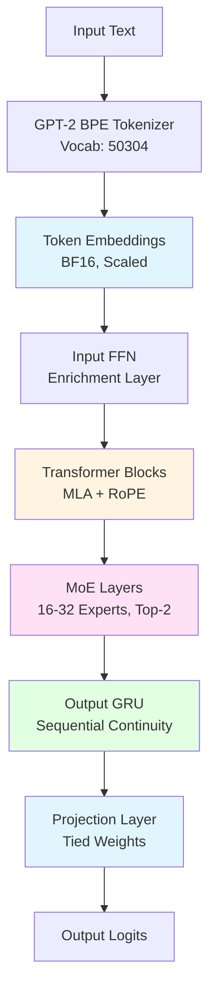
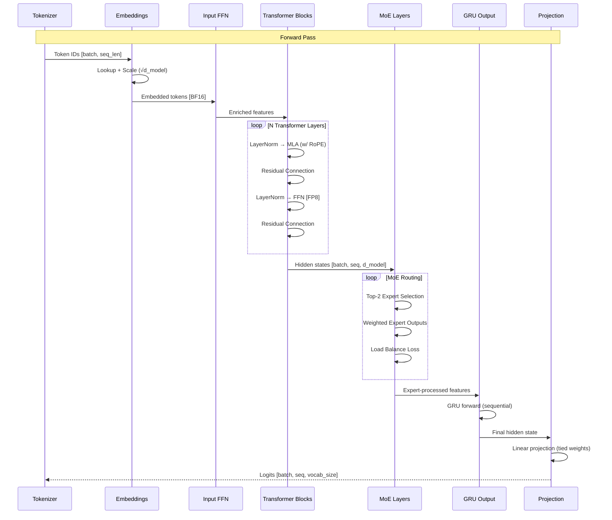
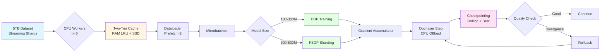

# Max LLM

A hybrid Large Language Model (100-500M parameters) combining Multi-head Latent Attention (MLA), Mixture of Experts (MoE), and GRU-based output layers for efficient training and inference on consumer hardware.

## Overview

Max LLM is designed for local training and deployment with a focus on:
- **Efficient long-context processing** via MLA attention with latent compression (75% KV cache reduction)
- **Scalable capacity** through Mixture of Experts without full compute cost
- **Progressive precision training** (FP4 → FP8 → BF16/FP8) for optimal convergence
- **Large-scale streaming data** support (5TB+ datasets)
- **Dual GPU training** optimized for 2×24GB GPUs with 8 CPU cores

**Target Use Cases:** Language modeling, text generation, domain-specific fine-tuning, research into hybrid architectures.

---

## Architecture

### Component Architecture

The model follows a hybrid pipeline combining multiple state-of-the-art techniques:



### Core Components

#### 1. **Tokenization & Embeddings**
- **Tokenizer:** GPT-2 BPE with vocabulary padded to 50304 tokens
- **Max Length:** 2048 tokens (extensible)
- **Embeddings:** BF16 precision, scaled by √(hidden_size)
- **Weight Tying:** Shared embeddings and output projection for efficiency

#### 2. **Multi-head Latent Attention (MLA)**
- **Query (Q):** Full-size representation
- **Key/Value (K/V):** Compressed to latent dimension (512)
- **Position Encoding:** RoPE (Rotary Position Embedding) in latent space
- **Optimization:** Flash Attention 2/3 for memory efficiency
- **Precision:** BF16 for all MLA weights
- **Benefit:** 75% reduction in KV cache size + FP8 KV cache for inference

#### 3. **Transformer Blocks**
- **Normalization:** Pre-LayerNorm architecture
  - `x + MLA(LayerNorm(x))`
  - `x + FFN(LayerNorm(x))`
- **FFN Precision:** FP8 (FP4 in early training phase)
- **Kernels:** Fused MLP operations for speed

#### 4. **Mixture of Experts (MoE)**
- **Experts:** 16-32 expert networks
- **Routing:** Top-2 expert selection per token
- **Precision:** BF16 for both experts and gating network
- **Load Balancing:** Scheduled balance loss to prevent expert collapse
- **Capacity:** Scales model capacity without proportional compute increase

#### 5. **Output GRU Layer**
- **Purpose:** Sequential continuity for generation tasks
- **Weights:** FP8 precision
- **Hidden State:** BF16 precision
- **Behavior:** 
  - Reset per batch during training
  - Persistent state during inference

#### 6. **Progressive Precision Training**
Training proceeds through three phases with automatic rollback on divergence:

| Phase | Progress | Component Precision | Activation Precision |
|-------|----------|---------------------|---------------------|
| **Phase 1** | 0-30% | FP4 (FFN/RNN), BF16 (Attn/MoE/Emb) | FP8 |
| **Phase 2** | 30-80% | FP8 (FFN/RNN), BF16 (Attn/MoE/Emb) | FP8 |
| **Phase 3** | 80-100% | FP8 (FFN/RNN), BF16 (Attn/MoE/Emb) | BF16/FP8 Mixed |

**Fixed Precision Components:**
- Attention layers: Always BF16
- MoE layers: Always BF16
- Token embeddings: Always BF16

### Data Flow and Interaction



### Training Pipeline



### Memory Optimization Strategy

| Component | Training Memory | Inference Memory | Optimization |
|-----------|----------------|------------------|--------------|
| **Embeddings** | BF16 | BF16 | Weight tying |
| **Attention Weights** | BF16 | BF16 | Flash Attention |
| **KV Cache** | BF16 | FP8 | Latent compression (75% reduction) |
| **FFN Weights** | FP8 | BF16 export | Progressive precision |
| **MoE Experts** | BF16 | BF16/Pruned | Expert merging |
| **GRU Weights** | FP8 | BF16 export | State persistence |
| **Activations** | FP8 | BF16 | Gradient checkpointing (attention only) |

---

## Training Phases

### A) Pre-training
- **Dataset:** 5TB mixed corpus (streaming)
- **Precision Schedule:** FP4 → FP8 → Mixed BF16/FP8
- **Strategy:** Long schedule with large effective batch sizes
- **Distribution:** DDP (small models) or FSDP (large models)

### B) Fine-tuning
- **Dataset:** 10-200GB curated domain data
- **Precision:** FP8 → Early BF16 transition
- **Adjustments:** Lower learning rate, higher MoE balance weight
- **Focus:** Domain adaptation and task specialization

### C) Post-training
- **SFT (Supervised Fine-Tuning):** Instruction following
- **RLHF/DPO (Optional):** Preference alignment
- **Calibration:** Temperature and penalty tuning
- **Export:** Expert pruning/merging, BF16 weights

---

## System Requirements

### Hardware
- **GPU:** 2× 24GB VRAM (NVIDIA recommended for CUDA 12.1 support)
- **CPU:** 8+ cores for data preprocessing
- **RAM:** 32GB+ recommended
- **Storage:** SSD for dataset cache (100GB+), Total capacity for 5TB dataset

### Software
- **Python:** 3.10+
- **CUDA:** 12.1
- **PyTorch:** 2.3.0+
- **Key Libraries:** transformers, deepspeed, xformers, flash-attn (desired but optional)

---

## Installation

### Quick Setup

```bash
# Clone the repository
git clone https://github.com/yourusername/max_llm.git
cd max_llm

# Run setup script (creates .venv, installs all dependencies)
source setup.sh
```

The setup script will:
1. Create a Python virtual environment (`.venv`)
2. Install `uv` package manager
3. Install PyTorch with CUDA 12.1 support
4. Install all project dependencies
5. Install DeepSpeed for distributed training
6. Verify the installation

### Manual Setup

```bash
# Create virtual environment
python3 -m venv .venv
source .venv/bin/activate

# Install dependencies
pip install uv
uv pip install torch --index-url https://download.pytorch.org/whl/cu121
uv pip install -e ".[cuda121,dev,training]"
uv pip install deepspeed
```

---

## Project Structure

```
max_llm/
├── configs/              # Training and model configurations
├── data/                 # Data preprocessing scripts
├── design/               # Architecture and design documents
├── src/                  # Source code
│   ├── models/          # Model implementations
│   ├── training/        # Training loops and utilities
│   └── data/            # Data loading and streaming
├── tests/                # Unit and integration tests
├── scripts/              # Helper scripts
├── setup.sh             # Automated setup script
├── install_deps.sh      # Dependency installer
├── pyproject.toml       # Project configuration
└── README.md            # This file
```

---

## Monitoring & Safety

### Tracked Metrics
- Loss and perplexity
- Training throughput (tokens/sec)
- Memory utilization
- Quantization error
- Expert utilization and balance
- GPU temperature

### Safety Features
- **Automatic Rollback:** On NaN/Inf or loss spikes
- **Checkpointing:** Rolling last 3 + best model with atomic saves
- **Precision State:** Stored with each checkpoint
- **Generation Sampling:** Regular quality checks for degeneration

---

## Design Philosophy

Max LLM is designed for collaborative development between humans and AI coding assistants. Our principles prioritize simplicity, modularity, and context efficiency.

### Key Principles

- **KISS First** - Straightforward solutions over clever ones
- **TDD (Test-Driven Development)** - Write tests first, then implementation
- **Context Window Efficiency** - Vertical feature slicing, Factory/Builder patterns, decorators
- **Type Hints Everywhere** - Self-documenting code with full type annotations
- **SOLID Principles** - Single responsibility, open/closed, Liskov substitution, interface segregation, dependency inversion
- **Modern Python Idioms** - Dataclasses, pattern matching (3.10+), context managers
- **Documentation Strategy** - Comprehensive headers, minimal inline comments
- **MLOps & Monitoring** - Built-in drift detection, checkpointing, continuous validation
- **AI Assistant Friendly** - Atomic commits, clear handoffs, breadcrumb TODOs
- **Code Organization** - Max 500 lines/file, clean imports, vertical slicing

### For Contributors (Especially AI Assistants)

**Before coding:**
1. **READ [`design/plan-checklist.md`](design/plan-checklist.md) FIRST** - Your primary scratch pad
   - Check "Next Actions" for what to work on
   - Read "Last Handoff" for current state
2. Read [`design/plan.md`](design/plan.md) for detailed architecture
3. Review recent commits for additional context

**While coding:**
- Make atomic commits with descriptive messages
- Update documentation immediately (docstrings + README if needed)
- Leave TODO breadcrumbs for next developer
- Run validation: `mypy`, `ruff`, `black`, `pytest`

**Before finishing:**
- Update [`design/plan-checklist.md`](design/plan-checklist.md) "Last Handoff" section
- Document what was completed and what's next

**📖 Full Details:** See [`design/philosophy.md`](design/philosophy.md) for comprehensive guidelines, code examples, and best practices.

---

## Contributing

Contributions are welcome! Please see `CONTRIBUTING.md` for guidelines.

## License

[Your License Here]

## Citation

```bibtex
@software{max_llm,
  title = {Max LLM: Hybrid MLA-Transformer-MoE-RNN},
  author = {[Your Name]},
  year = {2026},
  url = {https://github.com/yourusername/max_llm}
}
```

---

## References

- Multi-head Latent Attention (MLA)
- Mixture of Experts (MoE)
- Flash Attention
- Rotary Position Embeddings (RoPE)
- Progressive Precision Training
