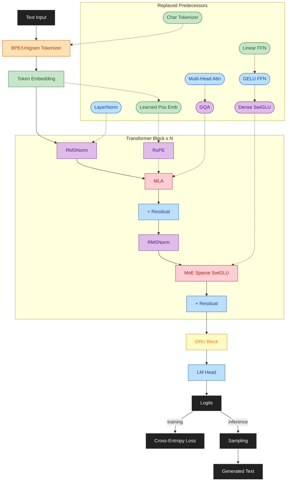

# Max LLM

Hybrid LLM research project (100–500M params): GQA/MLA + MoE + GRU output, optimized for local training on consumer hardware.

**Status:** Phase 1 (foundation ⏳ in progress) → Phase 2 (skeleton) next
**Repository:** [github.com/maxjbarfuss/max_llm](https://github.com/maxjbarfuss/max_llm)

## Why This Project?

**Learn by building.** Max LLM is a hands-on laboratory for understanding modern LLM architectures: how attention works, why mixture-of-experts scales differently, how to trade off memory for speed, and what makes one tokenizer better than another. Each phase builds incrementally—no black boxes, no mystery.

**Experiment locally.** Train and iterate on consumer hardware (dual 24GB GPUs). No cloud costs, no waiting for expensive cluster time. Benchmark new ideas cheaply, measure trade-offs precisely, and keep reproducible records.

**9-phase roadmap (phases 1–9) from scratch to hybrid models.** Start with character-level tokenization and linear layers (Phase 2), progress through standard transformers (Phase 3–4 with modern upgrades), then explore exotic architectures: mixture-of-experts (Phase 8) and GRU-transformer hybrids (Phase 9). **See what actually works**, not what papers claim.

**Comprehensive data strategy.** Build an unrestricted, diverse world model across Phases 2–5 (100–500M tokens including adult, controversial, and specialized content) for robust generalization. Layer safety guardrails through SFT and DPO in Phases 6–9. See [design/DESIGN.md#data-strategy-summary](design/DESIGN.md#data-strategy-summary) for sourcing guidelines and phase-by-phase data tasks.

**Reproducibility as a first principle.** Deterministic seeds, explicit configs, atomic commits linked to results. Every experiment is repeatable; every result is explainable.

---

## Quick Start

```bash
source setup.sh
```

See [SETUP.md](SETUP.md) for full instructions.

## Architecture Evolution

Final architecture (Phase 9) showing the complete pipeline from text to output.
Solid color = current component, rounded pill = replaced predecessor (colored by introducing phase).



| Color | Phase | Component |
|-------|-------|-----------|
| ⬛ Black | — | I/O: Text Input, Logits, Loss, Sampling, Generated Text |
| 🟢 Green | 2 | Token Embedding |
| 🔵 Blue | 3 | Residual connections, LM Head |
| 🟠 Orange | 4 | BPE / Unigram Tokenizer |
| 🟣 Purple | 5 | RMSNorm, RoPE |
| 🔴 Red | 8 | MLA (replaces GQA), MoE (replaces dense SwiGLU) |
| 🟡 Yellow | 9 | GRU hybrid blocks |
| Rounded pill | — | Replaced predecessors (colored by introducing phase) |

## Docs Summary

- [SETUP.md](SETUP.md): environment setup (WSL2 on Windows; Linux/macOS/WSL1 not supported)
- [CONTRIBUTING.md](CONTRIBUTING.md): workflow and PR rules
- [design/DESIGN.md](design/DESIGN.md): architecture, engineering principles, phased roadmap, testing strategy
- [design/PLAN.md](design/PLAN.md): phase progress, next steps, execution tracking
- [.github/CONTRIBUTORS.md](.github/CONTRIBUTORS.md): contributor authorization and PR validation checklist
- [.github/SKILLS.md](.github/SKILLS.md): required technical skills and working discipline
- [.github/CODEOWNERS](.github/CODEOWNERS): code review ownership

## Contributor Entry Points

- Human contributors: [CONTRIBUTING.md](CONTRIBUTING.md)
- AI agents: [design/PLAN.md](design/PLAN.md) -> [CONTRIBUTING.md](CONTRIBUTING.md)

## License

Apache License 2.0. See [LICENSE](LICENSE).
