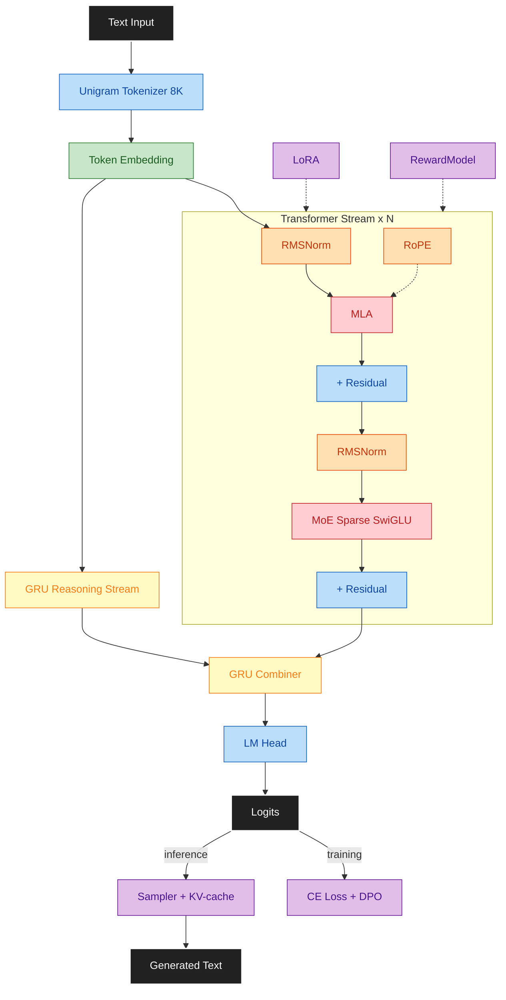

# Max LLM

LLM research repo for building, training, and evaluating modern language models on local hardware.

**Status:** Current phase and progress live in [.github/MEMORY.md](.github/MEMORY.md) (working session), [.github/SESSION_LOG.md](.github/SESSION_LOG.md) (recent history), [.github/SESSION_LOG_ARCHIVE.md](.github/SESSION_LOG_ARCHIVE.md) (older history), and [docs/PLAN.md](docs/PLAN.md).

**Repository:**
[github.com/maxjbarfuss/max_llm](https://github.com/maxjbarfuss/max_llm)

---

## Quick Start

Setup first, then use the entrypoint docs for the workflow you need:

- [scripts/setup/README.md](scripts/setup/README.md): environment setup and platform requirements
- [scripts/build/README.md](scripts/build/README.md): C++ build wrapper and modes
- [src/config/README.md](src/config/README.md): config system (adding fields, versioning, test fixtures)
- [src/data/README.md](src/data/README.md): data prep workflow
- [src/training/README.md](src/training/README.md): training configurations
- [src/inference/README.md](src/inference/README.md): inference configurations
- [outputs/README.md](outputs/README.md): milestone vs ephemeral artifact layout
- [tests/README.md](tests/README.md): test execution

## Docs

- [.github/MEMORY.md](.github/MEMORY.md): current session working state
- [.github/SESSION_LOG.md](.github/SESSION_LOG.md): recent completed-session history
- [.github/SESSION_LOG_ARCHIVE.md](.github/SESSION_LOG_ARCHIVE.md): archived older session history
- [docs/PLAN.md](docs/PLAN.md): phased roadmap, task checklists, and exit criteria
- [docs/DESIGN.md](docs/DESIGN.md): architecture and data design
- [docs/OPTIMIZATION.md](docs/OPTIMIZATION.md): validated optimization learnings and current defaults
- [docs/PHASE_1_CLOSEOUT.md](docs/PHASE_1_CLOSEOUT.md) | [docs/PHASE_2_CLOSEOUT.md](docs/PHASE_2_CLOSEOUT.md) | [docs/PHASE_3_CLOSEOUT.md](docs/PHASE_3_CLOSEOUT.md) | [docs/PHASE_4_CLOSEOUT.md](docs/PHASE_4_CLOSEOUT.md): completed-phase historical reports
- [config/README.md](config/README.md): TOML config field reference for all sections
- [CONTRIBUTING.md](CONTRIBUTING.md): workflow and contributor authorization
- [.github/AGENTS.md](.github/AGENTS.md): AI agent standard (Claude, o1, custom models)
- [.github/SKILLS.md](.github/SKILLS.md): AI agent instructions
- [.github/LESSONS.md](.github/LESSONS.md): agent mistake patterns
- [.github/CODEOWNERS](.github/CODEOWNERS): code ownership

Architecture, phase progression, and data strategy live in [docs/DESIGN.md](docs/DESIGN.md). Active execution detail lives in [docs/PLAN.md](docs/PLAN.md). Historical outcomes live in the phase closeouts.

## Architecture Diagram

## License

Apache License 2.0. See [LICENSE](LICENSE).
