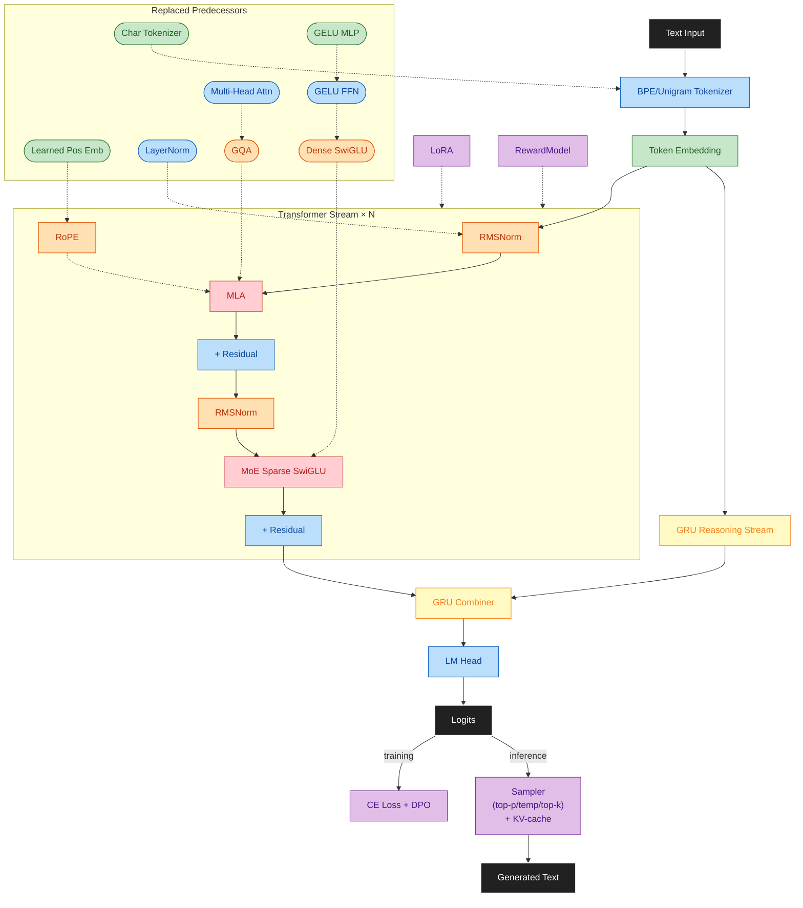

# Max LLM

LLM research lab for building, training, and evaluating modern architectures on local hardware.

**Status:** Current phase and progress live in [.github/MEMORY.md](.github/MEMORY.md) (working session), [.github/SESSION_LOG.md](.github/SESSION_LOG.md) (history), and [docs/PLAN.md](docs/PLAN.md).

**Repository:**
[github.com/maxjbarfuss/max_llm](https://github.com/maxjbarfuss/max_llm)

## Why This Project?

**Learn by building.** Modern sequence modeling lab where architecture and training decisions are tested, measured, and explained through incremental implementation.

**Experiment locally.** Optimized for dual-GPU hardware and fast iteration. Validates throughput, memory, and quality tradeoffs without cloud infrastructure.

**Reproducible.** Configs, seeds, checkpoints, and data tracked for reliable re-runs. TDD with measurable validation at each phase.

---

## Quick Start

Setup, then pick your entrypoint:

- [scripts/setup/README.md](scripts/setup/README.md): environment setup and platform requirements
- [scripts/build/README.md](scripts/build/README.md): C++ build wrapper and modes
- [scripts/data/README.md](scripts/data/README.md): data prep workflow
- [src/training/README.md](src/training/README.md): training configurations
- [src/inference/README.md](src/inference/README.md): inference configurations
- [tests/README.md](tests/README.md): test execution

Docs:

- [.github/MEMORY.md](.github/MEMORY.md): current session working state
- [.github/SESSION_LOG.md](.github/SESSION_LOG.md): append-only history of completed work
- [docs/PLAN.md](docs/PLAN.md): phased roadmap and task checklists
- [docs/PLAN.md](docs/PLAN.md): phased roadmap and exit criteria
- [docs/DESIGN.md](docs/DESIGN.md): architecture, engineering constraints, data strategy
- [CONTRIBUTING.md](CONTRIBUTING.md): workflow and contributor authorization
- [.github/AGENTS.md](.github/AGENTS.md): AI agent standard (Claude, o1, custom models)
- [.github/SKILLS.md](.github/SKILLS.md): AI agent instructions
- [.github/LESSONS.md](.github/LESSONS.md): agent mistake patterns
- [.github/CODEOWNERS](.github/CODEOWNERS): code ownership

## Design

**7-phase progression** (100–500M params on dual-GPU): minimal model → architectural upgrades → pretraining → post-training alignment. Each phase produces working text-in → text-out LLM with measurable validation.

**Final architecture (Phase 7):** Transformer with modern optimizations (RMSNorm, RoPE, MLA, sparse MoE) + dual-stream reasoning (GRU streams → GRU combiner). Solid rectangles show Phase 7 components; rounded pills show replaced predecessors.

| Color | Phase | Component |
|-------|-------|-----------|
| ⬛ Black | — | I/O (Text Input, Logits, Loss, Generated Text) |
| 🟢 Green | 2 | Token Embedding |
| 🔵 Blue | 3 | Residual, LM Head, BPE/Unigram Tokenizer |
| 🟠 Orange | 4 | RMSNorm, RoPE, GQA (replaced by MLA in P6) |
| 🟣 Purple | 5 | LoRA, Reward model, Sampler (top-p/temp/top-k), KV-cache, DPO/RLHF, SFT, grounding |
| 🔴 Red | 6 | MLA (replaces GQA), MoE Sparse SwiGLU |
| 🟡 Yellow | 7 | GRU Reasoning Stream, GRU Combiner |
| Rounded pill | — | Replaced predecessors |

### Data Strategy

**1–500M tokens** across 7 phases: toy datasets (P2–3) → unrestricted pretraining with curriculum (P4: 75% neutral, 20% controversial, 5% harmful) → post-training alignment (P5–7: SFT, grounding, preference, reasoning traces). Safety applied post-training.

| Phase | Tokens | Data Sources & Purpose | Training Configuration |
|-------|--------|------------------------|------------------------|
| **2** | 1–10M | **TinyStories + WikiText-103** — reproducibility, overfit tests, seed hardening | Single-GPU, char tokenizer, learning loop validation |
| **3** | 10–50M | **WikiText BPE (442K tokens, 4.54 chars/token)** — decoder architecture, training stability, optimizations (multi-backend attention, DataLoader, torch.compile, DDP) | Multi-backend attention (Flash/Sage/xFormers), DataLoader optimization, torch.compile, DDP (2 GPUs) |
| **4** | 10–500M | **OpenWebText (10–50M) → FineWeb (50–100M) → Curriculum (100–500M)** — Llama architecture (RMSNorm, RoPE, SwiGLU, GQA); staged curriculum: 75% neutral, 20% controversial, 5% harmful | FSDP for 300M+ params, chunked token caching |
| **5** | 1–5M SFT 50K–500K grounding 10K–100K preference | **SFT** (OpenAssistant, ShareGPT) + **grounding** (GSM8K, MATH, ARC) + **preference** (HH-RLHF, UltraFeedback) + 5–10% harmful | LoRA, KV-cache, DPO, reward modeling |
| **6** | 1–5M pairs | **Partitioned SFT + preference** by topic/domain — expert specialization; curriculum for expert drift monitoring | MoE routing diagnostics, expert utilization tracking |
| **7** | 50K–500K triples | **Reasoning traces** (GSM8K, MATH, ARC-Challenge, OpenOrca) + **STaR self-generated** — 60% reasoned / 40% direct | Dual-stream training, teacher forcing, reasoning accuracy validation |

**Details:** [docs/DESIGN.md](docs/DESIGN.md) for architecture, training efficiency (BF16/FP8), data sourcing, engineering constraints.

## License

Apache License 2.0. See [LICENSE](LICENSE).
