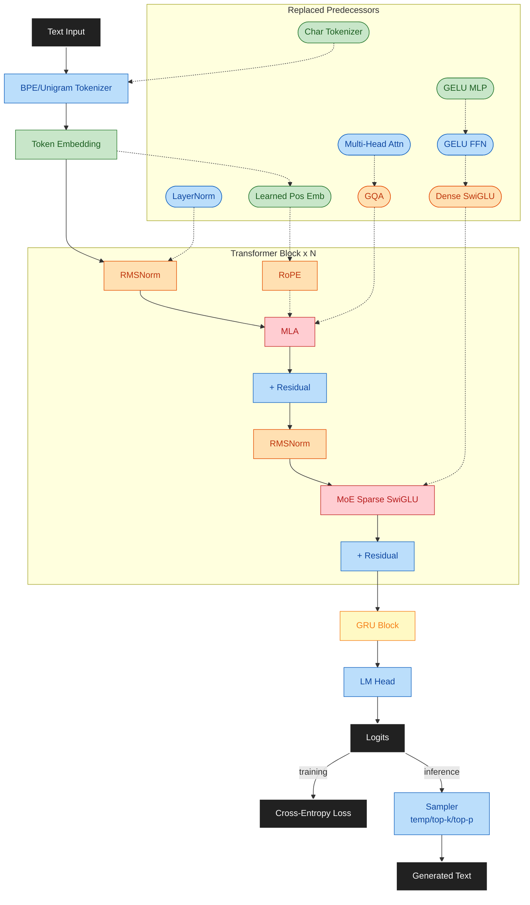

# Max LLM

Hands-on LLM research lab for building, training, and evaluating modern architectures on local hardware.

**Status:** Current phase and progress live in [docs/SESSION.md](docs/SESSION.md) and [docs/PLAN.md](docs/PLAN.md).

**Repository:**
[github.com/maxjbarfuss/max_llm](https://github.com/maxjbarfuss/max_llm)

## Why This Project?

**Learn by building.** Max LLM is a hands-on lab for modern sequence modeling. Each phase adds one core capability so architecture and training decisions can be tested, measured, and explained.

**Experiment locally.** The project is optimized for consumer GPUs and fast iteration. The goal is to validate tradeoffs in throughput, memory, and quality without relying on cloud-scale infrastructure.

**Progressive roadmap.** The 8 phases move from minimal tokenization and linear models to full transformers and hybrid architectures. The emphasis is on clear, verifiable improvements rather than paper-chasing.

**Data strategy with intent.** Data selection, preprocessing, and evaluation are treated as first-class engineering work.

**Reproducibility by design.** Configs, seeds, and checkpoints are tracked so experiments can be re-run and compared reliably.

---

## Quick Start

Start with setup, then pick the entrypoint you need:

- [scripts/setup/README.md](scripts/setup/README.md): full environment setup steps and platform requirements
- [scripts/build/README.md](scripts/build/README.md): C++ build wrapper and common build modes
- [scripts/data/README.md](scripts/data/README.md): end-to-end data prep workflow with various configurations and datasets
- [src/training/README.md](src/training/README.md): how to run training with various configurations
- [src/inference/README.md](src/inference/README.md): how to run inference on multiple configurations
- [tests/README.md](tests/README.md): how to run tests from the repo root or the tests/ folder

Docs and policies:

- [docs/SESSION.md](docs/SESSION.md): current focus, next steps, and session log (start here for status)
- [docs/PLAN.md](docs/PLAN.md): phased execution roadmap and exit criteria (reference for current phase)
- [docs/DESIGN.md](docs/DESIGN.md): architecture, engineering constraints, and data strategy
- [CONTRIBUTING.md](CONTRIBUTING.md): repository workflow and contributor authorization
- [.github/SKILLS.md](.github/SKILLS.md): AI agent instructions and working discipline
- [.github/LESSONS.md](.github/LESSONS.md): recorded agent mistake patterns (read before each session)
- [.github/CODEOWNERS](.github/CODEOWNERS): code ownership and review responsibility

## Architecture

Phase 8 combines GQA/MLA attention, MoE feedforward blocks, and a GRU output stage into a single local-first stack. The diagram below is a Phase 8 snapshot of the full text → output pipeline. Solid rectangles are current components in Phase 8. Rounded pills show predecessors replaced in earlier phases, colored by the phase they were introduced. For deeper design context, see [docs/DESIGN.md](docs/DESIGN.md).

| Color | Phase | Component |
|-------|-------|-----------|
| ⬛ Black | — | I/O: Text Input, Logits, Loss, Generated Text |
| 🟢 Green | 2 | Token Embedding |
| 🔵 Blue | 3 | Residual connections, LM Head, BPE / Unigram Tokenizer, Sampler (temp/top-k/top-p) |
| 🟠 Orange | 4 | RMSNorm, RoPE, GQA (Llama-Style Upgrades) |
| 🔴 Red | 7 | MLA (replaces GQA), MoE (replaces dense SwiGLU) |
| 🟡 Yellow | 8 | GRU hybrid blocks |
| Rounded pill | — | Replaced predecessors (colored by introducing phase) |

## License

Apache License 2.0. See [LICENSE](LICENSE).
