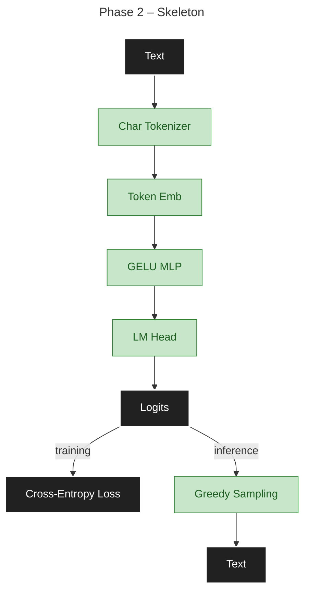
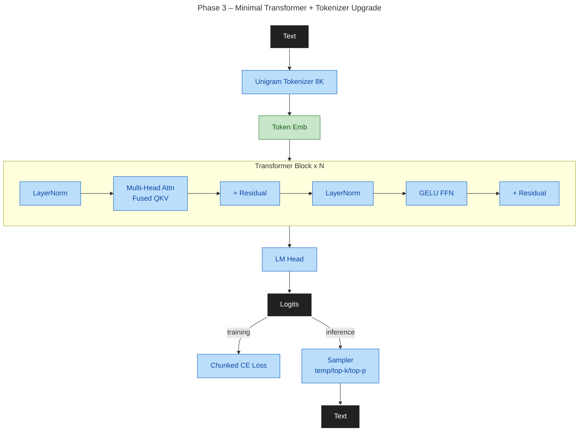
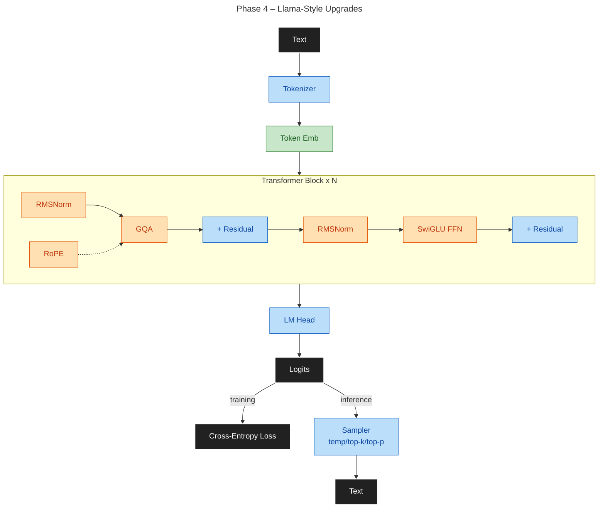
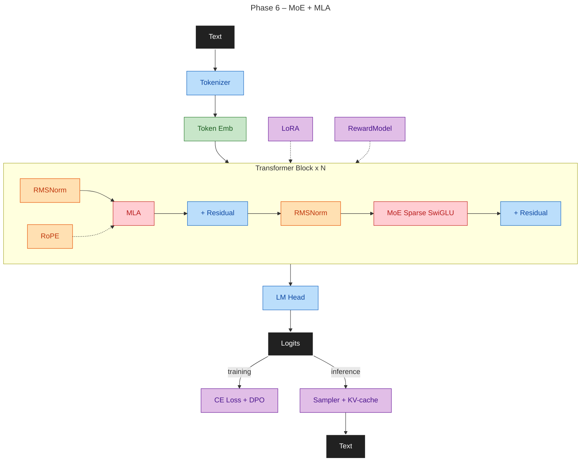
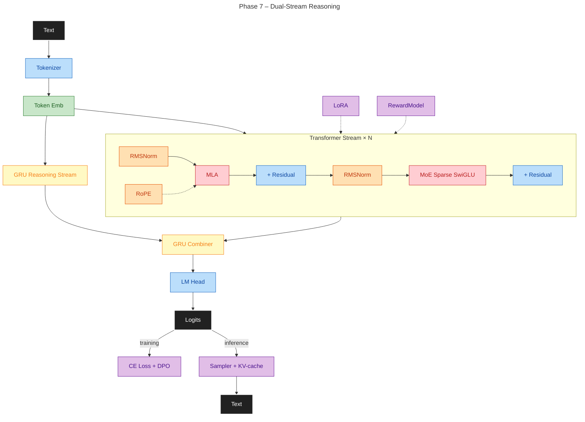
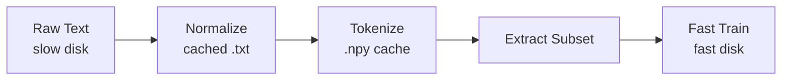

# Max LLM Design

**Goal**: 100–500M parameter LLM on dual-GPU hardware. Modern architecture (GQA, MLA, MoE, RoPE, DPO). Reproducible, clean interfaces, measurable improvements.

**Pipeline**: Tokenization → pre-training → fine-tuning → alignment. Benchmark-driven architecture validation.

**See also**: [PLAN.md](PLAN.md) for detailed execution.

---

## Phased Roadmap

7 phases (1–7), foundation → production. Each has clear goal and measurable exit criteria.

| Phase | Goal | Deliverables | Data Strategy |
|-------|------|--------------|----------------|
| **1** | Foundation | Design, repo setup, config system, build tools, CI, test scaffolding | Setup; no training data |
| **2** | Skeleton & Reproducibility | Config, seed control, char tokenizer, training loop, checkpointing, metrics | TinyStories + WikiText-103 (1–10M tokens); overfit test |
| **3** | Capable GPT-2-like model (~60M params, coherent output) | Decoder architecture (8–10L/1024H/16H, Unigram 8K vocab, 2048 ctx); full optimization stack (Flash Attn, BF16, DDP, FSDP, WSD scheduler, AdamW fused, fused QKV, scaled residual init, chunked CE loss, early stopping, label smoothing); training run to coherent text generation | Mixed corpus: TinyStories (~10%), WikiText-103 (full ~100M tokens), OpenWebText (~12%), FineWeb-Edu (partial); Unigram 8K tokenizer with EOS and NFKC/unk filtering |
| **4** | Llama Architecture + Scale-Up Training | RMSNorm, RoPE, SwiGLU, GQA, FSDP for 300M+ params, chunked token caching, data filters, A/B comparison vs Phase 3; multi-phase curriculum pretraining | OpenWebText/FineWeb 10–500M tokens with staged ramp (10–50M, 50–100M, 100–500M curriculum stages) |
| **5** | Post-Training | KV-cache, SFT, LoRA, grounding (math/logic/world-model/games), DPO or PPO/GRPO, continual learning | 1–5M SFT pairs, 50K–500K grounding (GSM8K, MATH, ARC), 10K–100K preference pairs (HH-RLHF, UltraFeedback) + 5–10% harmful, 5K–10K reward labels |
| **6** | MoE + MLA | MLA (latent KV compression), sparse MoE, top-k gating, load-balance loss, continual expert specialization | Partitioned SFT + preference (1–5M pairs) with curriculum; expert utilization tracking |
| **7** | Dual-Stream Reasoning | GRU Reasoning Stream + GRU Combiner (gated fusion); scheduled teacher forcing (100%→0%); STaR bootstrap; reasoning accuracy delta | 50K–500K (input, trace, answer) triples (GSM8K, MATH, ARC-Challenge, OpenOrca); STaR traces; 60% reasoned / 40% direct |

**Status**: Phase 4 in progress — RMSNorm ✅, RoPE ✅, FFN variants (SwiGLU/ReLU²/xIELU) ✅, position encoding A/B suite (AddRoPE/ALiBi/RelPosBias) ✅, norm variants (FlashNorm/DyT/CRMSNorm) ✅, GQA/MQA ✅ (`num_kv_heads`); 30K-step best-in-breed run active (p4_llama_20k, val≈3.62 @ step 9500).

---

## Architecture Overview

**Philosophy**: Minimal → validated → modern. TDD + overfit tests. Benchmark-driven changes.



- **Phase 2**: Text → Char Tokenizer → Token Emb + Pos → GELU MLP → LM Head → Logits → CE Loss / Greedy Sample → Text

---



- **Phase 3**: Text → **Unigram 8K** → Token Emb + Pos → [**LayerNorm** → **Multi-Head Attn (Fused QKV)** → **GELU FFN**] × N → **LM Head** → **Chunked CE Loss** / **Sampler** → Text

---



- **Phase 4**: Text → Tokenizer → Token Emb + **RoPE** → [**RMSNorm** → **GQA** → **SwiGLU**] × N → LM Head → Sampler → Text

---


- **Phase 5**: Phase 4 + **KV-cache**, **SFT**, **LoRA**, **grounding**, **DPO**

---



- **Phase 6**: Phase 4 with **MLA** (replaces GQA) + **MoE SwiGLU**

---



- **Phase 7**: Phase 6 + parallel **GRU Reasoning Stream** → **GRU Combiner** (gated fusion)

---

**Diagram notes**: Bold = new in phase. Tokenizer: Char (P2) → Unigram 8K (P3); BPE benchmarked and superseded (Unigram reached lower loss faster at equal scale).

| Component | Phase | Phases Used | Notes |
|-----------|-------|-------------|-------|
| Tokenizer | 2 | 2–7 | Char (P2), Unigram 8K (P3+); BPE benchmarked but Unigram wins on convergence speed |
| Embeddings | 2 | 2–7 | Token + positional; P2–3: learned additive table; P4+: `pos_type` selects from `learned`/`rope`/`add_rope`/`alibi`/`rel_pos` |
| Transformer block | 3 | 3–7 | Pre-norm, causal attention, residual FFN |
| Norm variants | 4 | 4–7 | `norm_type` selects: `rms` (RMSNorm, P4 default); `flash` (param-free RMSNorm); `dyt` (Dynamic Tanh, Zhai 2025); `crms` (Centered RMSNorm); `layer` (LayerNorm, P3 legacy) |
| RoPE | 4 | 4–7 | Rotary Q/K encoding; `pos_type = "rope"`; A/B alternatives: AddRoPE, ALiBi, RelPosBias |
| FFN variants | 4 | 4–7 | SwiGLU (Llama, default P4+); ReLU² (sparse ~50%); xIELU (piecewise quad/exp, 2 params); GELU (legacy) |
| GQA | 4 | 4–5 | Grouped-query attention via `num_kv_heads` (`null`=MHA, `1`=MQA, `N`=GQA); replaced by MLA in P6 |
| KV-cache | 5 | 5–7 | Cached K/V for autoregressive generation |
| LoRA | 5 | 5–7 | Low-rank adaptation (<1% params) |
| Reward model | 5 | 5–7 | Learned reward for PPO/GRPO |
| MLA | 6 | 6–7 | Latent KV compression (DeepSeek-style) |
| MoE layer | 6 | 6–7 | Sparse routing, expert tracking |
| GRU Reasoning Stream | 7 | 7 only | Parallel GRU producing per-position reasoning states |
| GRU Combiner | 7 | 7 only | Gated fusion of transformer + GRU states |

**Hardware**: Dual 24GB GPUs (RTX); single GPU inference; CPU fallback.

---

## Training Infrastructure

- **Data**: Streaming; RAM LRU + SSD token cache
- **Dataloader**: Parallel workers, prefetch, pinned memory, persistent workers
- **Distributed**: DDP (P3+); FSDP (P3+, advanced from P4)
- **Attention**: Multi-backend (Flash/Sage/xFormers/standard) with automatic fallback (P3+)
- **Compilation**: torch.compile (P3+)
- **Scale**: Microbatching + gradient accumulation

### Data Strategy

**Philosophy**: Pre-train on unrestricted data (P2–4); apply safety via post-training (P5).

**By phase**:
- **P2**: TinyStories, WikiText-103 (1–10M tokens)
- **P3**: TinyStories (~10%), WikiText-103 (full ~100M), OpenWebText (~12%), FineWeb-Edu (partial); Unigram 8K with EOS per doc, NFKC normalization
- **P4**: OpenWebText/FineWeb (10–500M tokens); 75% neutral + 20% controversial + 5% harmful; curriculum stages at 10M/50M/100–500M
- **P5**: 1–5M instruction pairs, 50K–500K grounding (GSM8K, MATH, ARC), 10K–100K preference pairs + 5–10% harmful
- **P6**: Partitioned SFT + preference (1–5M) for expert specialization
- **P7**: 50K–500K (input, trace, answer) + STaR traces; 60% reasoned / 40% direct

**Sourcing**: Respect licenses, exclude PII, document provenance, deduplicate 5–10%.

**Monitoring**: Loss, perplexity, throughput, memory; alerts on NaN/Inf, OOM, thermal.

**Checkpoints**: Rolling + best; atomic writes; include RNG + config snapshot.

### Data Pipeline



**Design**: Pre-tokenize once on slow disk → cache → stage chunks to fast disk with LRU (P4+).

---

## Training Efficiency

**Baseline**: BF16 + AMP throughout.

**Precision schedule** (future exploration):
| Stage | Steps | FFN/RNN |
|-------|-------|---------|
| 1 | 0–30% | BF16 + FP32 master |
| 2 | 30–80% | FP8 (RTX 4090+/H100) |
| 3 | 80–100% | FP8/BF16 mixed |

Attention/MoE/embeddings always BF16. Rollback on divergence.

**Optimizations** (P3 stack, validated on RTX 4090 dual-GPU):
1. Multi-backend attention (Flash/Sage/xFormers) — 2–4× memory reduction (P3)
2. torch.compile — ~20–30% throughput (P3)
3. Fused QKV projection — single `nn.Linear(d, 3d)` with `.chunk(3)` split; removes 3→1 kernel launches (P3.8)
4. Scaled residual init — `out_proj` + FFN `linear2` use `N(0, 0.02/√(2·L))` (GPT-2 style) to prevent variance growth with depth (P3.8)
5. Chunked cross-entropy — iterates (B·T, V) in chunks of 4096; saves ~800 MB at B=24, T=2048, V=8192 (P3.9)
6. FSDP — model sharding for larger configs; integrated alongside DDP (P3.9, advanced from P4)
7. AdamW with fused CUDA kernel (`fused=True`, β=(0.9, 0.95)) — replaces vanilla Adam (P3)
8. WSD (Warmup-Stable-Decay) scheduler — sqrt-decay shape; supports multi-phase continuation (P3)
9. Gradient checkpointing (P4+)
10. FP8 linear/FFN (P4+)
11. Activation offloading (P4+)

---

## Config System: Version-Aware Evolution

All config classes (`ModelConfig`, `TrainingConfig`, `DataConfig`, `InferenceConfig`) have `__version__: ClassVar[int]` to track config evolution without brittleness.

**When to increment version**:
- Required new fields (no default) → increment
- Breaking validation changes → increment
- Optional fields with defaults → no increment

**Non-breaking additions**: Add field with default → old TOML files work, old checkpoints recognized.

**Checkpoint versioning**: `save_checkpoint()` includes `config_versions` dict. `load_checkpoint()` validates version match; raises `ConfigVersionMismatchError` if mismatch. Use `strict_version_check=False` to load anyway (breaks reproducibility guarantee).

**Test fixture resilience**: Use schema-aware builders from `tests/conftest.py`:
```python
from tests.conftest import build_model_config

# Bad (brittle): hardcode all 15 fields
config = ModelConfig(hidden_size=64, num_layers=1, ...)  # Breaks when fields added

# Good (resilient): override only what you test
config = build_model_config(hidden_size=64, num_layers=1)  # Auto-fills defaults
```

New fields automatically get sensible test defaults; no test refactoring on config changes.

---

## Reproducibility


**Artifact naming**: `p<phase>_<artifact>_<yyyymmdd>_<commit>_<seed>` — includes seed, config snapshot, dataset fingerprint, environment.

---

## See Also

- [PLAN.md](PLAN.md) — Phase execution with exit criteria
- [config/README.md](../config/README.md) — Full field reference and config system API (versioning, checkpoints, test fixtures)
- [.github/AGENTS.md](../.github/AGENTS.md) — Development standard (principles, discipline, workflow for all contributors)
- [.github/SKILLS.md](../.github/SKILLS.md) — Detailed workflows (tool use, session bootstrap, commit procedure)
- [CONTRIBUTING.md](../CONTRIBUTING.md) — Contributor entry point
