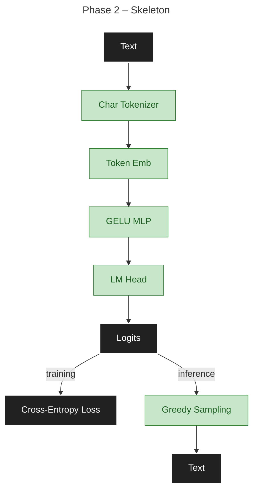
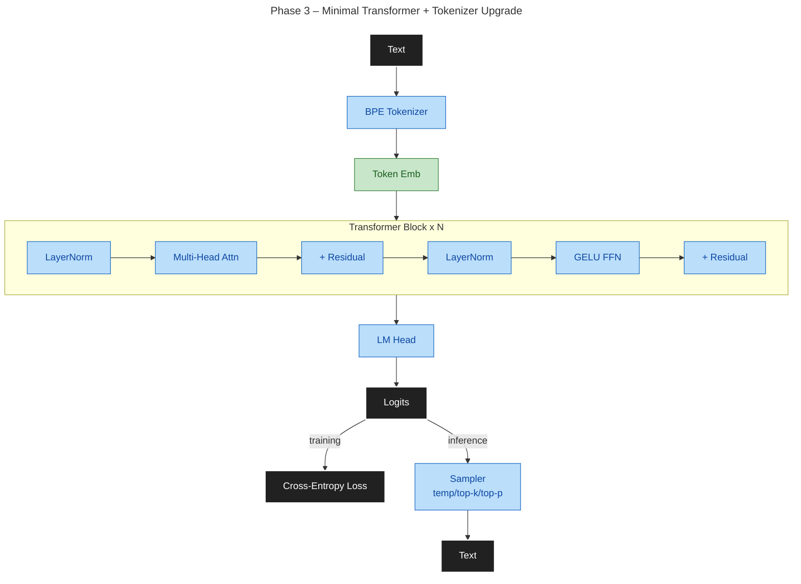
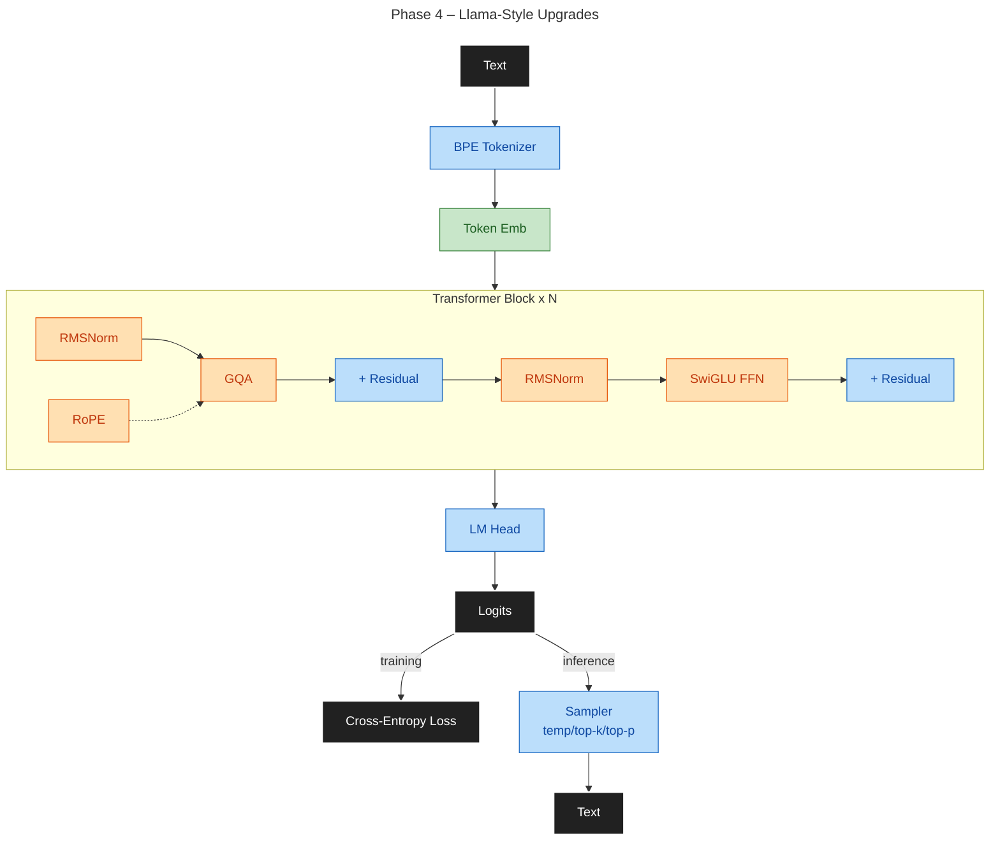
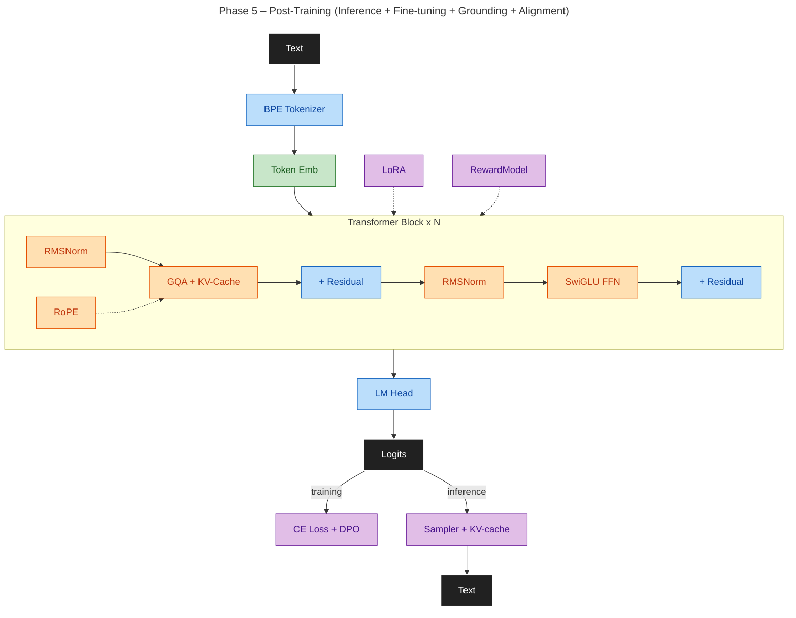
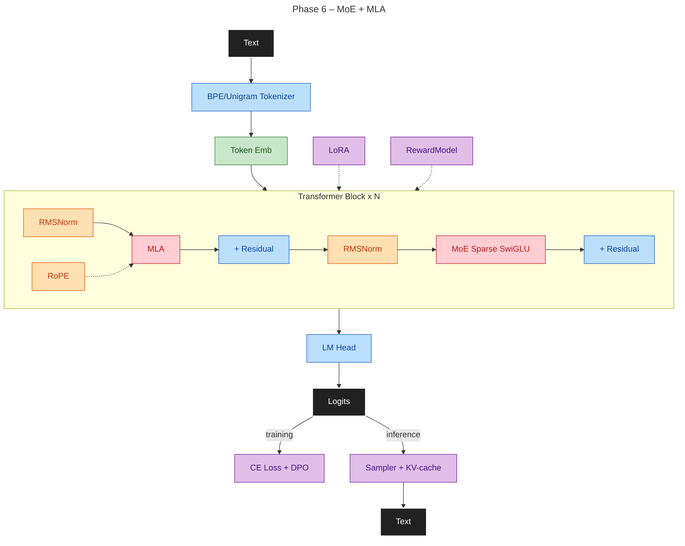
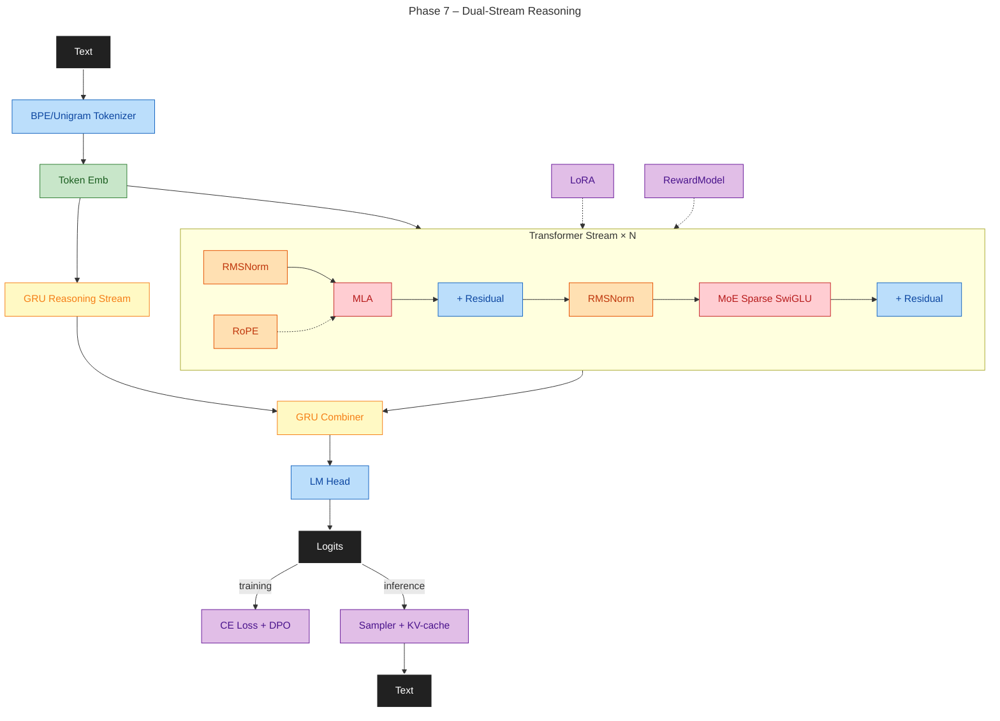
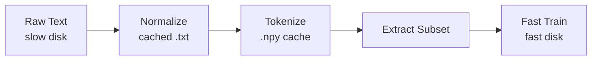

# Max LLM Design

**Goal**: Build a working 100–500M parameter LLM on local dual-GPU hardware, incorporating modern architectural advances (GQA, MLA, MoE, RoPE, DPO) as a research testbed. Emphasize reproducibility, clean interfaces, and measurable improvements at each phase.

**Target**: End-to-end pipeline from tokenization through pre-training, fine-tuning, and preference-based alignment, with clear methodology for architecture validation and comparison.

---

## Phased Roadmap

**Delivery**: 7 phases (1–7), foundation → production. Each has clear goal and measurable exit criteria. Detailed execution in [PLAN.md](PLAN.md).

| Phase | Goal | Deliverables | Data Strategy |
|-------|------|--------------|----------------|
| **1** | Foundation | Design and plan, repo setup, config system, build tools and dependency management, CI pipeline, minimal model test scaffolding | Setup phase; no training data |
| **2** | Skeleton & Reproducibility | Config, seed control, char tokenizer, training loop, checkpointing, perplexity metrics | TinyStories + WikiText-103 subset (1–10M tokens); overfit test |
| **3** | Decoder + BPE + Training Stability | Embeddings, causal attention, FFN, LM head, BPE tokenizer, generation (greedy + temperature + top-k/top-p), LR scheduling, gradient clipping, AMP, gradient accumulation, single-GPU training | WikiText BPE (442K tokens), 10–50M tokens; establishes stable single-GPU training primitives |
| **4** | Llama Architecture + Distributed Training + Full Pretraining | RMSNorm, RoPE, SwiGLU, GQA + Flash Attention 2, multi-GPU (DDP/FSDP), torch.compile, chunked token caching, data filters, A/B comparison vs Phase 3; multi-phase curriculum pretraining | OpenWebText/FineWeb 10–500M tokens with staged ramp (10–50M OpenWebText, 50–100M FineWeb subsets, 100–500M curriculum stages); distributed training at scale |
| **5** | Post-Training: Inference + SFT + Grounding + Alignment | KV-cache (2× speedup), SFT + masking, LoRA (<1% params), grounding on math/logic/world-model/game data, DPO or PPO/GRPO with learned reward model, >60% preference accuracy, continual learning with replay buffer | 1–5M SFT instruction pairs, 50K–500K grounding examples (GSM8K, MATH, ARC, games), 10K–100K preference pairs (HH-RLHF, UltraFeedback) + 5–10% harmful examples, 5K–10K reward labels |
| **6** | MoE + MLA + Continual Expert Routing | MLA (upgrade GQA → latent KV compression), sparse MoE, top-k gating, load-balance loss, continual expert specialization | Partitioned SFT + preference data (1–5M pairs) with curriculum scheduling; expert utilization drift tracking |
| **7** | Dual-Stream Reasoning Pipeline | GRU Reasoning Stream (parallel to transformer) + GRU Combiner (gated fusion); scheduled teacher forcing (100% gold → 0%); graceful degradation (GRU-zeroed mode); inference feedback loop; STaR bootstrap on self-generated traces; reasoning accuracy vs baseline delta; overhead benchmark | 50K–500K structured (input, reasoning trace, answer) triples (GSM8K, MATH, ARC-Challenge, OpenOrca/Orca-2); STaR self-generated traces; 60% reasoned / 40% direct training mix |

**Done**: Reproducible pre-train/fine-tune/post-train locally; reliable checkpointing; stable across precision phases.

---

## Architecture Overview

**Design philosophy**: Start minimal, validate each component through TDD and overfit tests, then layer modern techniques incrementally. All architectural changes require benchmark evidence.

**Base flow** — every phase is a working text-in → text-out LLM:

- **Phase 2**: Text → Char Tokenizer → Token Emb (+ learned positional) → GELU MLP → LM Head → Logits → Cross-Entropy Loss (training) / Greedy Sampling (inference) → Text

---

- **Phase 3**: Text → **BPE Tokenizer** → Token Emb (+ learned positional) → [**LayerNorm** → **Multi-Head Attn** → **GELU FFN**] × N → **LM Head** → Logits → **Sampler (temp/top-k/top-p)** → Text

---

- **Phase 4**: Text → BPE → Token Emb → [**RMSNorm** → **GQA + RoPE** → **SwiGLU**] × N → LM Head → Logits → Sampler → Text

---

- **Phase 5**: Same forward architecture as Phase 4 + **KV-cache**, **top-p sampling**, **SFT**, **LoRA**, **grounding**, **DPO**

---

- **Phase 6**: Text → BPE/Unigram → Token Emb → [RMSNorm → **MLA + RoPE** → **MoE SwiGLU**] × N → LM Head → Logits → Sampler → Text

---

- **Phase 7**: Text → BPE/Unigram → Token Emb → [**Transformer Stream** ‖ **GRU Reasoning Stream**] → **GRU Combiner** → LM Head → Logits → Sampler → Text

---

### Diagram Guide

**Purpose**: Make phase deltas explicit so contributors can quickly see what changed and what stayed stable.

- **Phase delta marker**: Bold items in each phase summary are the new architectural or training capabilities introduced in that phase.
- **Stable execution path**: Training remains Logits → Cross-Entropy Loss. Inference remains Logits → Softmax → Sampler → next token (greedy in P2, +top-k/temperature in P3, +top-p/KV-cache in P5).
- **Tokenizer progression**: Character-level in Phase 2 for reproducibility; BPE default in Phase 3; BPE vs Unigram benchmark on identical corpus slices; promote Unigram only if it improves at least one axis without regressions.

| Component | Phase | Phases Used | Notes |
|-----------|-------|-------------|-------|
| Tokenizer | 2 | 2–7 | Char tokenizer in P2, BPE default from P3, optional Unigram only after benchmark win |
| Embeddings | 2 | 2–7 | Token + positional (learned, then RoPE) |
| Transformer block | 3 | 3–7 | Pre-norm, causal attention, residual FFN |
| RoPE | 4 | 4–7 | Replaces learned positional, supports extrapolation |
| SwiGLU | 4 | 4–7 | Replaces GELU-based FFN |
| GQA | 4 | 4–5 | Reduces KV cache; replaced by MLA in Phase 6 |
| KV-cache | 5 | 5–7 | Cached K/V for O(n) autoregressive generation |
| LoRA | 5 | 5–7 | Low-rank adaptation; < 1% trainable params |
| Reward model | 5 | 5–7 | Learned reward function for PPO/GRPO alignment |
| MLA | 6 | 6–7 | Latent KV compression, upgrades GQA (DeepSeek-style) |
| MoE layer | 6 | 6–7 | Sparse routing, expert utilization tracking |
| GRU Reasoning Stream | 7 | 7 only | Parallel GRU stream on input embeddings; produces per-position reasoning hidden states |
| GRU Combiner | 7 | 7 only | Gated fusion of transformer + GRU hidden states; update gate learns per-token weighting |

**Hardware targets**: Dual 24GB GPUs (consumer/RTX level); single GPU inference; graceful CPU fallback.

---

## Training Infrastructure

- **Data**: Streaming-first for multi-TB corpus; RAM LRU + SSD token cache
- **Dataloader**: 6 workers, prefetch 2, pinned memory, persistent workers
- **Distributed**: DDP for 100–300M params; FSDP full sharding for 300–500M (introduced Phase 4)
- **Scale**: microbatching + gradient accumulation

### Data Strategy

**Philosophy**: Build unrestricted world model (P2–4, 1–500M tokens) including adult, controversial, and harmful content. Apply safety guardrails via post-training (P5: SFT, grounding, alignment). Ensures comprehensive generalization and robust adversarial behavior before safety constraints.

**Execution by phase**:
- **P2–3 (1–50M tokens)**: TinyStories, WikiText-103 subsets; establishes training stability
- **P4 (10–500M tokens, curriculum + distributed)**:
  - **Stage P4a**: 75% neutral/technical (FineWeb, Wikipedia, GitHub, UCI, Cosmopedia)
  - **Stage P4b**: 20% adult/controversial (Tor forums, Reddit NSFW)
  - **Stage P4c**: 5% harmful (mlabonne jailbreaks, refusals)
  - **Curriculum**: 10M OpenWebText → 50M FineWeb subset → 100–500M full corpus; multi-GPU (DDP/FSDP)
- **P5 (post-training)**:
  - **Instruction (1–5M)**: OpenAssistant, Self-Instruct, ShareGPT (ChatML/Alpaca templates)
  - **Grounding (50K–500K)**: GSM8K, MATH, ARC-Challenge, BoolQ (input → explanation → answer)
  - **Preference (10K–100K)**: HH-RLHF, UltraFeedback + 5–10% harmful; 5K–10K reward labels
- **P6 (MoE + MLA)**: Partitioned SFT + preference (1–5M pairs) for expert specialization; routing diagnostics
- **P7 (reasoning)**: 50K–500K triples (input, trace, answer) from GSM8K, MATH, ARC-Challenge, OpenOrca; STaR self-generated traces; 60% reasoned / 40% direct mix

**Sourcing principles**: Respect licenses, exclude PII, document provenance, deduplicate 5–10%, track curriculum stages.

**Training program:**
1. Pre-train: large mixed corpus, long schedule, precision progression
2. Fine-tune: curated domain data, lower LR, earlier BF16 transition
3. Post-train: SFT, optional DPO/RLHF, calibration, export-ready weights

**Reliability:**
- Required metrics: loss, perplexity, throughput, memory, quantization error, expert utilization
- Required alerts: NaN/Inf, loss spikes, OOM, disk pressure, thermal
- Checkpoints: rolling recent + best, atomic writes, include RNG + precision phase

### Data Pipeline Reference

**Workflow** — normalize once on slow disk, train on fast disk:

**Execution**: YAML-driven; see [scripts/data/README.md](../scripts/data/README.md) for details.

**Pipeline design**:
- **Pre-tokenize once, cache forever**: Tokenize on slow disk; eliminates runtime overhead
- **Parquet metadata** (P4+): Columnar format for efficient chunk queries, schema evolution
- **Chunked staging with LRU** (P4+): Copy token chunks (e.g., 50M) to fast disk on demand; LRU eviction
- **Background prefetch** (P4+): Thread-based next-chunk copy during training; simple I/O-bound solution

---

## Training Efficiency

Stable baseline: **BF16 + AMP** throughout (well-supported, numerically safe). Layer in optimizations as the project matures.

**Progressive precision schedule** (adjustable; stage boundaries tunable on stability/performance):
| Stage | Steps | FFN/RNN | Notes |
|-------|-------|---------|-------|
| 1 | 0–30% | BF16 + FP32 master weights | Stable AMP baseline |
| 2 | 30–80% | FP8 (via `torchao` on Ada/Hopper) | Requires RTX 4090+ or H100; skip on older GPUs |
| 3 | 80–100% | FP8/BF16 mixed runtime | Tune to stability |

- **Always BF16**: attention, MoE, embeddings
- **Inference KV cache**: FP8
- **Rollback**: automatic on divergence detection

**Throughput and memory optimizations** (implement in order of impact):
1. Flash Attention 2 — 2–4× attention memory reduction, significant speedup
2. `torch.compile(mode="max-autotune")` — ~20–30% throughput gain
3. Selective gradient checkpointing — trades compute for activation memory
4. FP8 linear/FFN layers — `torchao` or `transformer-engine` on RTX 4090 / H100
5. Activation offloading — CPU offload during forward for memory headroom on deep models

**Exploration track**: FP4 training — evaluate when `torchao` FP4 support matures or target hardware warrants it.

---

## Engineering Principles

**Design patterns and working discipline**: See [.github/AGENTS.md](../.github/AGENTS.md) for SOLID, DRY, KISS, YAGNI, composition-over-inheritance, and agent working standards.

**Project-specific constraints**:
- **TDD-first**: failing test before every behavior; red → green → refactor → coverage
- **Reproducibility by default**: deterministic seeds, explicit configs, fingerprinted artifacts
- **Type-driven**: typed public interfaces (`mypy` enforced), validated configs (Pydantic)
- **Complexity-aware**: document Big-O; set perf budgets; better asymptotics over micro-opts
- **Fail fast**: validate early with clear errors; prefer immediate feedback over silent degradation
- **Measure first**: profile before optimizing; data-driven only (no speculative optimization)

---

## Code Structure

**Vertical slices**: each feature (tokenizer, embeddings, attention, etc.) owns its Python module and optional C++/CUDA kernels.

**Directory layout**:
- `src/config/`: Config system (Phase 1, complete)
- `src/models/{feature}/`: Python implementation (Phase 2+)
  - Optional: `kernels/` with headers, implementation, tests (C++20)
- `src/core/`: Shared C++ infrastructure
- `src/training/`: Training pipeline (Phase 3+)
- `tests/unit/`: Per-module unit tests

**Adding a feature**: Create `src/models/my_feature/my_feature.py` with PyTorch module. Write tests in `tests/unit/test_my_feature.py` (TDD). If CUDA needed, add `kernels/` subdirectory with CMakeLists.txt.

---

## Testing Strategy

**Workflow**: TDD cycle at every step: Red → Green → Refactor → Coverage. Write failing test before implementing any new behavior.

**Test layers**:
- **Unit tests** (Python + C++): module-level functionality
- **Integration tests** (Python): multi-component workflows
- **Contract tests**: shape/dtype validation, config validation
- **Quick validation tests**: small model overfit, convergence check, generation samples

**Make targets**:
- `make test-quick`: fast mixed-language gate (<3 min locally, Python + C++)
- `make test-py` / `make test-cpp`: language-specific rapid loops
- `make test`: full suite
- `make test-cov`: coverage with artifacts (JUnit XML + summary)

**Test coverage by phase**:
- **P2**: Config validation
- **P3+**: Model layer tests, training loop checks
- **P4+**: Architecture A/B comparisons, multi-GPU consistency
- **P5+**: SFT pipeline, LoRA merge, KV-cache equivalence, DPO/RL losses, reward model accuracy, safety evaluation, grounding datasets, replay buffer
- **P6**: Expert routing, load-balance convergence, MLA vs GQA equivalence
- **P7**: GRU streams (forward/backward), combiner gating, dual-stream integration, reasoning accuracy delta, teacher forcing convergence, STaR bootstrap quality

**Standards**:
- **Python**: One test file per module; fixtures; assert shapes/dtypes; parametrize CPU/GPU; skip CUDA if unavailable
- **C++**: GTest in `src/*/kernels/tests/`; run via `make test-cpp`

---

## Coding Standards

**Enforcement**: Automated via `make check` (lint + format-check + type-check + quick tests). See [CONTRIBUTING.md](../CONTRIBUTING.md#change-checklist) for pre-commit requirements.

**Python**: Python 3.10+, type hints required (`mypy` strict), styled via `black` + `isort` + `ruff`. No global state where determinism matters.

**C++**: C++20 required, styled via `clang-format` (LLVM) + `clang-tidy` (zero warnings). Smart pointers only (no raw `new`/`delete`), const-correctness, limited public surface in `max_llm::` namespace. GPU compute in `.cu`; CPU fallback always provided. CUDA error checking on all calls.

**Build**: CMake 3.20+, Ninja, C++20 enforced. Release: `-O3 -march=native` + LTO. Debug: `-g` always. `-Werror` on all targets.

**Details**: Linting configs in repo root (`.ruff.toml`, `pyproject.toml`, `.clang-format`); build flags in `CMakeLists.txt`.

---

## Quality Gates

**Pre-commit**: `make check` must pass (lint, format-check, type-check, quick tests). See [CONTRIBUTING.md](../CONTRIBUTING.md#change-checklist) for full checklist.

**Validation checks per phase**:
- **Phase 2–3**: Overfit test, convergence check, generation samples
- **Phase 4+**: Multi-GPU consistency, precision stage stability, cross-phase regression (<10% degradation on core metrics without documented tradeoff)
- **Phase 5+**: Attention backend equivalence, KV-cache correctness, safety evaluation suite
- **Phase 6**: Expert routing balance, load-balance convergence, MLA vs GQA equivalence
- **Phase 7**: Dual-stream integration, reasoning-enabled vs GRU-zeroed accuracy delta, STaR bootstrap quality

**Delivery contract** (per new model component):
1. Interface: Typed constructor/forward + expected tensor shapes
2. Config: Pydantic schema with defaults and validation
3. Tests: At least one failing unit test before implementation (TDD)
4. Performance: Baseline latency/memory/throughput budget
5. Failure modes: Documented edge conditions (OOM, NaN/Inf, device mismatch)

---

## Reproducibility Contract

Every training/benchmark run must capture:
- Seed values (Python, NumPy, PyTorch CPU/GPU)
- Config snapshot (commit hash + resolved config values)
- Dataset fingerprint (path, revision, or hash)
- Environment fingerprint (Python, PyTorch, CUDA, GPU model, driver)
- Artifact naming: `p<phase>_<artifact>_<yyyymmdd>_<commit>_<seed>` (see [PLAN.md](PLAN.md#phase-progress) for convention and examples)

Runs missing any of these are exploratory only — not baseline-comparable.

---

## CI/Deployment

- **Lint**: Every PR (ruff, mypy)
- **Format check**: Every PR (black, isort, clang-format)
- **Test**: Every PR (Python tests from current phase)
- **GPU build**: Nightly/manual (CUDA build, GTest, integration checks)
- **Artifact naming**: per Reproducibility Contract above

---

## Contributor Workflow

Workflow, git flow, and validation rules live in [CONTRIBUTING.md](../CONTRIBUTING.md). This design document focuses on architecture and engineering constraints.
