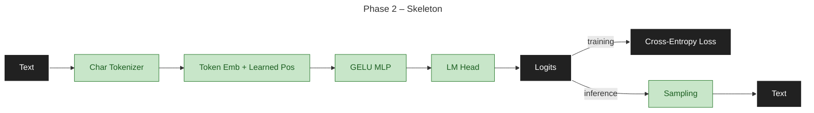
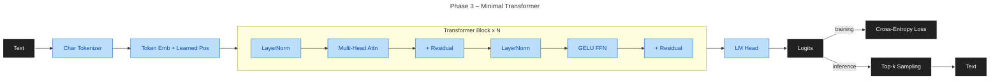
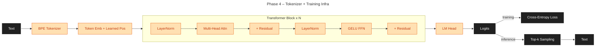
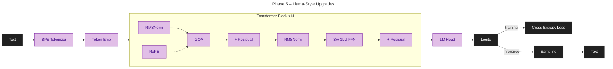
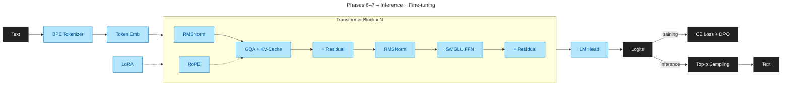
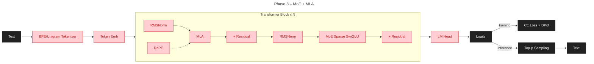
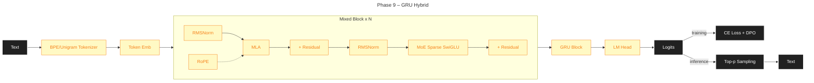
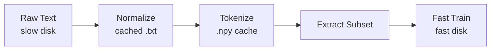

# Max LLM Design

**Goal**: Build a working 100–500M parameter LLM on local dual-GPU hardware, incorporating modern architectural advances (GQA, MLA, MoE, RoPE, DPO) as a research testbed. Emphasize reproducibility, clean interfaces, and measurable improvements at each phase.

**Target**: End-to-end pipeline from tokenization through pre-training, fine-tuning, and preference-based alignment, with clear methodology for architecture validation and comparison.

---

## Architecture Overview

**Design philosophy**: Start minimal, validate each component through TDD and overfit tests, then layer modern techniques incrementally. All architectural changes require benchmark evidence.

**Base flow** — every phase is a working text-in → text-out LLM:

- **Phase 2**: Text → Char Tokenizer → Token Emb + Learned Pos → GELU MLP → LM Head → Logits → Cross-Entropy Loss (training) / Sampling (inference) → Text

- **Phase 3**: Text → Char Tokenizer → Token Emb + Learned Pos → [**LayerNorm** → **Multi-Head Attn** → **GELU FFN**] × N → **LM Head** → Logits → Sampling → Text

- **Phase 4**: Text → **BPE Tokenizer** → (same transformer) → Sampling → Text *(tokenizer + training infra upgrade)*

- **Phase 5**: Text → BPE → Token Emb → [**RMSNorm** → **GQA + RoPE** → **SwiGLU**] × N → LM Head → Logits → Sampling → Text

- **Phases 6–7**: Same forward architecture as Phase 5 + **KV-cache**, **top-p sampling**, **SFT**, **LoRA**, **DPO**

- **Phase 8**: Text → BPE/Unigram → Token Emb → [RMSNorm → **MLA + RoPE** → **MoE SwiGLU**] × N → LM Head → Logits → Sampling → Text

- **Phase 9**: Text → BPE/Unigram → Token Emb → [Transformer ↔ **GRU** interleaved] × N → LM Head → Logits → Sampling → Text

**Bold** = new/changed component at that phase. Phases 6, 7 change inference (KV-cache, top-p) and training (SFT, LoRA, DPO) without altering the forward architecture.

Training: Logits → Cross-Entropy Loss (all phases). Inference: Logits → Softmax → Sampling → next token (greedy P2, +top-k/temperature P3, +top-p/KV-cache P6).

**Tokenizer strategy**: Start with character-level for Phase 2 (simplest, reproducible). Phase 4: switch to BPE via `tiktoken` or `sentencepiece`, then benchmark BPE vs Unigram using identical corpus slices. Promote Unigram only if strictly better on at least one dimension without degrading others. Vocabulary mismatch constraints must be explicit when swapping.

---

| Component | Phase | Phases Used | Notes |
|-----------|-------|-------------|-------|
| Embeddings | 2 | 2–9 | Token + positional (learned, then RoPE) |
| Transformer block | 3 | 3–9 | Pre-norm, causal attention, residual FFN |
| RoPE | 5 | 5–9 | Replaces learned positional, supports extrapolation |
| SwiGLU | 5 | 5–9 | Replaces GELU-based FFN |
| GQA | 5 | 5–9 | Reduces KV cache, improves scaling |
| MLA | 8 | 8–9 | Latent KV compression, upgrades GQA (DeepSeek-style) |
| MoE layer | 8 | 8–9 | Sparse routing, expert utilization tracking |
| GRU stage | 9 | 9 only | Optional recurrent alternative/augment |
| KV-cache | 6 | 6–9 | Cached K/V for O(n) autoregressive generation |
| LoRA | 6 | 6–9 | Low-rank adaptation; < 1% trainable params |
| Reward model | 7 | 7–9 | Learned reward function for PPO/GRPO alignment |

**Hardware targets**: Dual 24GB GPUs (consumer/RTX level); single GPU inference; graceful CPU fallback.

---

## Training Efficiency

Stable baseline: **BF16 + AMP** throughout (well-supported, numerically safe). Layer in optimizations as the project matures.

**Progressive precision schedule** (adjustable; stage boundaries tunable on stability/performance):
| Stage | Steps | FFN/RNN | Notes |
|-------|-------|---------|-------|
| 1 | 0–30% | BF16 + FP32 master weights | Stable AMP baseline |
| 2 | 30–80% | FP8 (via `torchao` on Ada/Hopper) | Requires RTX 4090+ or H100; skip on older GPUs |
| 3 | 80–100% | FP8/BF16 mixed runtime | Tune to stability |

- **Always BF16**: attention, MoE, embeddings
- **Inference KV cache**: FP8
- **Rollback**: automatic on divergence detection

**Throughput and memory optimizations** (implement in order of impact):
1. Flash Attention 2 — 2–4× attention memory reduction, significant speedup
2. `torch.compile(mode="max-autotune")` — ~20–30% throughput gain
3. Selective gradient checkpointing — trades compute for activation memory
4. FP8 linear/FFN layers — `torchao` or `transformer-engine` on RTX 4090 / H100
5. Activation offloading — CPU offload during forward for memory headroom on deep models

**Exploration track**: FP4 training — evaluate when `torchao` FP4 support matures or target hardware warrants it.

---

## Training Infrastructure

- **Data**: Streaming-first for multi-TB corpus; RAM LRU + SSD token cache
- **Dataloader**: 6 workers, prefetch 2, pinned memory, persistent workers
- **Distributed**: DDP for 100–300M params; FSDP full sharding for 300–500M (introduced Phase 4)
- **Scale**: microbatching + gradient accumulation

### Data Strategy

**Philosophy**: Build a complete, unrestricted world model across Phases 2–5 (1–500M tokens) by incorporating diverse content sources including adult, controversial, and harmful data. Layers of safety guardrails are applied via fine-tuning (SFT) in Phase 6 and alignment (DPO/RL) in Phases 7–9. This approach ensures comprehensive generalization and robust behavior under adversarial conditions before safety constraints are applied.

**Execution**:
- **Phases 2–4 (1–100M tokens)**: Toy datasets (TinyStories, WikiText-103), small corpus (OpenWebText subset), and medium corpus (FineWeb / FineWeb-Edu subset). Establishes training stability and tokenizer selection.
- **Phase 5 (100–500M tokens, multi-phase curriculum)**: Full unrestricted pretraining corpus with staged content introduction:
  - **Stage P5a** (neutral+technical): 75% FineWeb, Wikipedia, GitHub, UCI structured data (medical, scientific), and curated data (Cosmopedia)
  - **Stage P5b** (adult/controversial): 20% NSFW content (Tor forums, Reddit NSFW subreddits)
  - **Stage P5c** (harmful): 5% mlabonne harmful datasets (jailbreaks, refusals)
  - **Curriculum learning**: Gradual stage progression based on validation loss without catastrophic forgetting; enables robust generalization before alignment.
- **Phases 6–7 (instruction tuning + alignment)**: Domain-specific SFT (1–5M instruction pairs) with continual learning to prevent forgetting of P5 generalization. Preference data (10K–100K pairs) includes intentional harmful examples for robust rejection learning.
- **Phases 8–9 (expert routing + comprehensive evaluation)**: Expert specialization on partitioned domains; continual evaluation on incremental domain streams to measure catastrophic forgetting and real-world continual learning performance.

**Data sourcing principles**: Respect data licenses, exclude PII, document provenance, deduplicate 5–10% across sources, and track curriculum stage assignments for reproducibility.

**Training program:**
1. Pre-train: large mixed corpus, long schedule, precision progression
2. Fine-tune: curated domain data, lower LR, earlier BF16 transition
3. Post-train: SFT, optional DPO/RLHF, calibration, export-ready weights

**Reliability:**
- Required metrics: loss, perplexity, throughput, memory, quantization error, expert utilization
- Required alerts: NaN/Inf, loss spikes, OOM, disk pressure, thermal
- Checkpoints: rolling recent + best, atomic writes, include RNG + precision phase

### Data Pipeline Reference

**Workflow** — normalize once on slow disk, train on fast disk:

**Execution**: YAML-driven; see [scripts/data/README.md](../scripts/data/README.md) for Quick Start, config reference, and size guide.

**Pipeline design decisions** (implemented progressively across phases):
- **Pre-tokenize once, cache forever**: Tokenize on slow disk during preprocessing; eliminates runtime overhead and enables reproducible chunking
- **Parquet metadata** (Phase 4+): Columnar format enables efficient chunk range queries, split tracking, and schema evolution over JSON/dict
- **Chunked staging with LRU** (Phase 4+): Copy token chunks (e.g., 50M tokens) to fast disk on demand; reduces fast disk requirements vs full copy; LRU eviction when space limited
- **Background prefetch** (Phase 4+): `threading.Thread` copies next chunk while training runs on current chunk; simple I/O-bound solution with no multiprocessing overhead

---

## Phased Roadmap

**Delivery**: 9 phases (1–9), foundation → production. Each has clear goal and measurable exit criteria. Detailed execution in [PLAN.md](PLAN.md).

| Phase | Goal | Deliverables | Data Strategy |
|-------|------|--------------|----------------|
| **1** | Foundation | Design and plan, repo setup, config system, build tools and dependency management, CI pipeline, minimal model test scaffolding | Setup phase; no training data |
| **2** | Skeleton & Reproducibility | Config, seed control, char tokenizer, training loop, checkpointing, perplexity metrics | TinyStories + WikiText-103 subset (1–10M tokens); overfit test |
| **3** | Minimal Transformer | Embeddings, causal attention, FFN, LM head, generation (greedy + temperature + top-k) | OpenWebText subset + Gutenberg (10–50M tokens); validates transformer scaling |
| **4** | Training Stability | LR scheduling, gradient clipping, AMP, gradient accumulation, BPE/Unigram tokenizer benchmark, memory-mapped data, multi-GPU (DDP/FSDP), throughput tracking | FineWeb / FineWeb-Edu subset (50–100M tokens); tokenizer benchmark BPE vs Unigram; select best for P5+ |
| **5** | Llama Upgrades + Multi-Phase Curriculum | RMSNorm, RoPE, SwiGLU, GQA + Flash Attention 2, A/B comparison vs Phase 4; multi-phase pretraining with curriculum learning | Full pretraining: 100–500M tokens in 3 curriculum stages (neutral/technical→adult→harmful); core generalization phase |
| **6** | Inference & Fine-Tuning + Continual Learning | KV-cache (2× speedup), SFT + masking, LoRA (<1% params), eval benchmark selection; continual SFT with replay buffer | 1–5M SFT instruction pairs (OpenAssistant, Self-Instruct, ShareGPT); domain-specific streams; catastrophic forgetting mitigation |
| **7** | DPO/RL Alignment + Reward Modeling | Preference triplets, DPO or PPO/GRPO with learned reward model, frozen reference, >60% accuracy; continual learning in RL | 10K–100K preference pairs (HH-RLHF, UltraFeedback) + 5–10% harmful examples; 5K–10K reward labels (quality/safety/factuality) |
| **8** | MoE + MLA + Continual Expert Routing | MLA (upgrade GQA → latent KV compression), sparse MoE, top-k gating, load-balance loss, continual expert specialization | Partitioned SFT + preference data (1–5M pairs) with curriculum scheduling; expert utilization drift tracking |
| **9** | GRU Hybrid + Continual Evaluation | GRU baseline, transformer-GRU variants, memory scaling O(n²) vs O(n), 512–2048 tokens (extrapolation to 4096 for GRU/hybrid); continual benchmarking, NIAH retrieval eval | Static (HellaSwag, MMLU, TruthfulQA) + incremental domain streams (5–10 domains, 1K examples each); catastrophic forgetting measurement |

**Done**: Reproducible pre-train/fine-tune/post-train locally; reliable checkpointing; stable across precision phases.

---

## Engineering Principles

- **KISS first**: simplest correct design wins
- **TDD-first**: failing test before every behavior
- **Type-driven**: typed public interfaces, validated configs
- **Complexity-aware**: document Big-O; set perf budgets; better asymptotics over micro-opts
- **SOLID**: SRP, OCP, LSP, ISP, DIP; exceptions need evidence
- **Composition > indirection**: clear data flow
- **Reproducibility by default**: deterministic seeds, explicit configs
- **Fail fast**: validate early with clear errors
- **API discipline**: behavior changes include tests and docs
- **Measure first**: profile before optimizing; data-driven only

---

## Code Structure

**Vertical slices**: each feature (tokenizer, embeddings, attention, etc.) owns its Python module and optional C++/CUDA kernels.

**Directory layout**:
- `src/config/`: Config system (Phase 1, complete)
- `src/models/{feature}/`: Python implementation (Phase 2+)
  - Optional: `kernels/` with headers, implementation, tests (C++20)
- `src/core/`: Shared C++ infrastructure
- `src/training/`: Training pipeline (Phase 3+)
- `tests/unit/`: Per-module unit tests

**Adding a feature**: Create `src/models/my_feature/my_feature.py` with PyTorch module. Write tests in `tests/unit/test_my_feature.py` (TDD). If CUDA needed, add `kernels/` subdirectory with CMakeLists.txt.

---

## Testing Strategy

**Workflow**: TDD cycle at every step: Red → Green → Refactor → Coverage. Write failing test before implementing any new behavior.

**Test layers** (run all before merge):
- **Unit tests** (Python + C++): module-level functionality, no dependencies
- **Integration tests** (Python): multi-component workflows
- **Contract tests**: shape/dtype validation, config validation
- **Quick validation tests**: small model overfit, convergence check, generation samples

**Continual test scripts contract**:
- `make test-quick`: fast mixed-language quick gate (Python + C++, target <3 minutes locally)
- `make test-py`: Python-only rapid loop
- `make test-cpp`: C++-only rapid loop
- `make test`: full suite
- `make test-cov`: coverage run with report artifacts
- Each run publishes machine-readable artifacts (JUnit XML + coverage) and a short human-readable summary

**Test coverage expectations**:
- Phase 2: Config validation tests (no torch required)
- Phase 3+: Model layer tests (torch required), training loop quick checks
- Phase 5+: Architecture comparison tests (A/B), throughput benchmarks
- Phase 6+: SFT pipeline tests, LoRA merge correctness, KV-cache equivalence, evaluation harness integration
- Phase 7+: Preference data loading, DPO/RL loss computation, reward model accuracy, safety evaluation suite
- Phase 8+: Expert routing tests, load-balance convergence, MLA vs GQA equivalence at matching configs
- Phase 9: GRU forward/backward, hybrid integration, NIAH retrieval, cross-architecture comparison suite

**Python test standards**:
- One test file per module; use fixtures; no setup duplication
- Assert tensor shapes and dtypes; avoid brittle float equality checks
- Parametrize over CPU/GPU backends; skip GPU tests if CUDA unavailable

**C++ test standards** (GTest): Tests in `src/*/kernels/tests/` directories. Run via `make test-cpp`.

---

## Contributor Workflow

Workflow, git flow, and validation rules live in [CONTRIBUTING.md](../CONTRIBUTING.md). This design document focuses on architecture and engineering constraints.

---

## Coding Standards

### Python
- Python 3.10+ idioms only
- Type hints for all public classes and functions
- Minimal inline comments; prefer clear names and docstrings
- Import order: stdlib → third-party → local
- Avoid global state when deterministic behavior is required

### C++
- C++20 required (constexpr, concepts, modern idioms)
- `clang-format` (LLVM config) + `clang-tidy` with zero warnings
- Smart pointers only (`std::unique_ptr`, `std::shared_ptr`); no raw `new`/`delete`
- `const` correctness throughout; prefer pure functions
- Export limited public surface in `max_llm::` namespace; document preconditions in headers
- GPU compute in `.cu` files; CPU fallback always provided
- CUDA error checking macros on all CUDA calls

### Build
- CMake 3.20+, Ninja, C++20 enforced at configure time
- `-O3 -march=native` (release), `-g` always included
- LTO enabled for release; `-Werror` on all targets

---

## Quality Gates

**Before merge**: Run `make lint` (ruff, mypy), `make format-check` (black, isort, clang-format), `make test` (Python + C++ tests), and `make format` (auto-fix formatting).

**Validation checks** (run as appropriate per phase):
- Quick overfit test (small model, quick convergence check)
- Precision stage transition stability checks
- Multi-GPU consistency checks (Phase 4+)
- Attention backend equivalence checks (Phase 5+)
- Periodic generation regression samples (Phase 3+)
- Cross-phase regression gate: no new phase may degrade prior phase core metrics by >10% (perplexity, safety, throughput, or memory) without a documented tradeoff decision

**Delivery readiness (per new model component):**
1. Interface contract: typed constructor/forward signature + expected tensor shapes
2. Config contract: Pydantic config with defaults and validation constraints
3. Test contract: at least one failing unit test before implementation
4. Performance budget: baseline latency/memory/throughput target
5. Failure modes: documented edge conditions (OOM, NaN/Inf, device mismatch)

---

## Reproducibility Contract

Every training/benchmark run must capture:
- Seed values (Python, NumPy, PyTorch CPU/GPU)
- Config snapshot (commit hash + resolved config values)
- Dataset fingerprint (path, revision, or hash)
- Environment fingerprint (Python, PyTorch, CUDA, GPU model, driver)
- Artifact naming: `p<phase>_<artifact>_<yyyymmdd>_<commit>_<seed>` (see [PLAN.md](PLAN.md#phase-progress) for convention and examples)

Runs missing any of these are exploratory only — not baseline-comparable.

---

## CI/Deployment

- **Lint**: Every PR (ruff, mypy)
- **Format check**: Every PR (black, isort, clang-format)
- **Test**: Every PR (Python tests from current phase)
- **GPU build**: Nightly/manual (CUDA build, GTest, integration checks)
- **Artifact naming**: per Reproducibility Contract above
