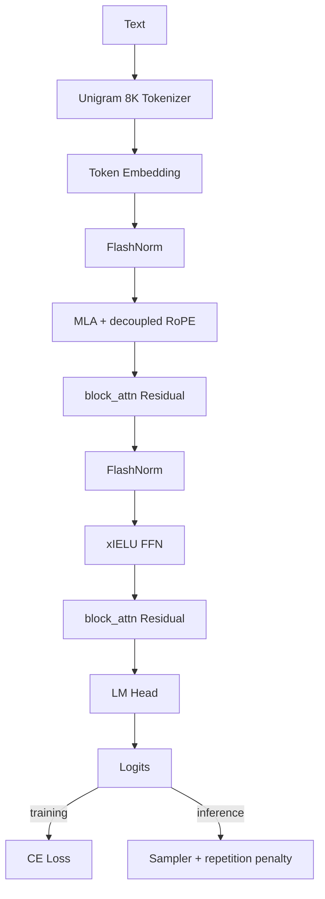

# Max LLM Design

Purpose: durable architecture, data, and system reference for the project. Use [PLAN.md](PLAN.md) for execution, [OPTIMIZATION.md](OPTIMIZATION.md) for validated training learnings, and the phase closeouts for historical evidence.

## Current State

- Phase 4 is complete: final anneal checkpoint reached ppl ~9.2, a 2.6x improvement over the best Phase 3 run.
- The validated Phase 4 stack is FlashNorm + MLA + xIELU + block-attn residuals + RoPE on a 12-layer, ~60M-parameter decoder.
- Phase 5 is the next execution surface: data cleanup, tokenizer decision, inference wins, Muon/Z-loss/uP, then SFT/grounding/alignment.

## Phase Map

| Phase | Purpose | Main deltas | Canonical reference |
|---|---|---|---|
| 1 | Foundation | Repo layout, config/build/test/CI baseline | [PHASE_1_CLOSEOUT.md](PHASE_1_CLOSEOUT.md) |
| 2 | Skeleton + reproducibility | Char baseline, seed control, checkpointing, overfit/inference gates | [PHASE_2_CLOSEOUT.md](PHASE_2_CLOSEOUT.md) |
| 3 | Capable decoder baseline | Unigram 8K, DecoderLM, Flash/bf16/DDP/WSD long-run stack | [PHASE_3_CLOSEOUT.md](PHASE_3_CLOSEOUT.md) |
| 4 | Llama-style scale-up | FlashNorm, RoPE family, MLA, xIELU, block-attn residuals, curriculum + anneal | [PHASE_4_CLOSEOUT.md](PHASE_4_CLOSEOUT.md) |
| 5 | Post-training | KV-cache, LoRA/SFT, grounding, DPO or PPO/GRPO, continual-learning eval | [PLAN.md](PLAN.md) |
| 6 | Sparse expert stack | MoE on the Phase 5 stack, routing diagnostics, dense-vs-sparse comparison | [PLAN.md](PLAN.md) |
| 7 | Dual-stream reasoning | GRU reasoning stream + gated combiner + STaR-style loop | [PLAN.md](PLAN.md) |

## Architecture

### Validated Stack (Phase 4)

- Tokenizer: Unigram 8K inherited from Phase 3.
- Model: 12 layers, hidden size 1024, 16 heads, 4 KV heads, context 1024, ~60M parameters.
- Core blocks: FlashNorm, MLA with decoupled RoPE, xIELU FFN, block-attn residuals.
- Inference: top-k / top-p / temperature sampler with repetition penalty.

### Forward-Carried Additions

| Phase | Additions on top of prior stack |
|---|---|
| 5 | KV-cache, YaRN or rope-base standardization, uP, Muon, Z-loss, LoRA, reward model, MoD candidate |
| 6 | Sparse MoE FFN and routing diagnostics |
| 7 | Parallel GRU reasoning stream and gated combiner |

### Component Inventory

| Component family | Current/default | Alternatives retained |
|---|---|---|
| Normalization | `flash` | `rms`, `dyt`, `crms`, `layer` |
| Position encoding | `rope` | `add_rope`, `alibi`, `rel_pos` |
| Attention | `mla` | `mha`, `swa`, `rla` |
| FFN | `xielu` | `swiglu`, `relu2`, `gelu` |
| Residual routing | `block_attn` | `full_attn`, `standard` |
| Fine-tuning | LoRA planned | full finetune intentionally deferred |

Hardware target: dual 24 GB-class RTX GPUs for training, single GPU inference, CPU fallback for correctness/debugging.

## Training System

- Data access: streaming plus RAM LRU and SSD token cache.
- Loader path: parallel workers, prefetch, pinned memory, persistent-worker support.
- Distributed path: DDP validated; FSDP available when memory pressure dominates.
- Attention backends: Flash preferred; Sage/xFormers/standard available with fallback.
- Compilation: `torch.compile` enabled on the stable path where backend compatibility allows it.
- Optimization baseline: AdamW fused + WSD scheduler + gradient accumulation + gradient clipping + bf16.
- Planned stack upgrades: Muon on 2-D weights, uP for hyperparameter transfer, Z-loss for logit stabilization.

## Data Design

Principle: unrestricted pretraining in Phases 2-4, then post-training safety and alignment in Phases 5-7.

### Actual Phase 4 Corpus

| Source | Tokens | Share | Key note |
|---|---|---|---|
| OpenWebText | 8.87B | 33% | Very short docs; strong packing/filtering target |
| FineWeb | 6.72B | 25% | Overlaps with FineWeb-Edu |
| Cosmopedia v2 | 5.37B | 20% | Synthetic Mistral-generated educational corpus |
| FineWeb-Edu | 2.68B | 10% | Subset of FineWeb; current double exposure |
| Wikipedia | 1.88B | 7% | Best factual anchor |
| WikiText-103 | 1.07B | 4% | Redundant with Wikipedia |
| TinyStories | 0.13B | 0.5% | Holdover from early phases |
| stories_young_children | 0.13B | 0.5% | Holdover from early phases |

### Current Quality Path

- NFKC normalization.
- Cc control-character stripping.
- Minimum-length filtering.
- Two-stage UNK filtering.
- Stratified per-source validation split.
- Spill-cache tokenization with resume support.

### Next Data Corrections

- Remove WikiText-103 from future pretraining mixes.
- Choose a single FineWeb policy instead of FineWeb + FineWeb-Edu overlap.
- Add OWT heuristics, language filtering, and near-dedup.
- Add sequence packing for short-document efficiency.
- Retrain tokenizer on the cleaned Phase 4 distribution if more pretraining is planned.

### Phase 5+ Data Shapes

| Phase | Data products |
|---|---|
| 5 | Cleaned pretraining corpus, 32K tokenizer decision, SFT pairs, grounding corpus, preference pairs, reward labels |
| 6 | Partitioned SFT/preference data for expert specialization |
| 7 | Reasoning-trace triples and STaR-derived traces |

## Data Pipeline

Design rule: expensive cleanup and dedup happen once per source; mixed packed shards are then reused across runs.

## Config Evolution

- Config classes are versioned so schema changes stay explicit.
- Required breaking fields increment version; optional defaulted fields do not.
- Checkpoints store config-version metadata to protect reproducibility.
- Runtime values remain canonical in [config/README.md](../config/README.md) and the milestone or ephemeral config files.
