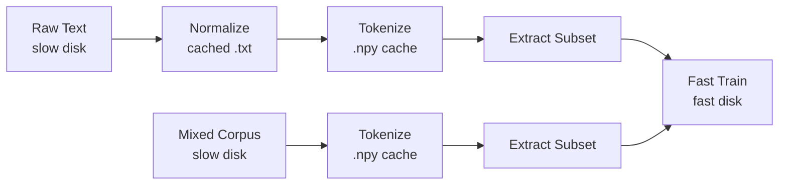

# Data Preparation Scripts

Quick reference for preparing training data. Run these scripts once; train repeatedly from the cached output.

## Overview

Expensive operations (normalize, tokenize) run once on slow disk and are cached. Fast subsets are extracted to fast disk for training iteration.



## Quick Start

### Single Dataset
```bash
# Pick a config and run
python scripts/data/run_data_prep.py \
    --config scripts/data/wikitext-103/default_ascii_small.yaml \
    --normalize --tokenize

# Then point your experiment config at the output
# config/milestones/p2_baseline.toml:
#   [data]
#   dataset_path = "data/fast/wikitext_1m_tokens__utf8.npy"

python -m src.training.train --config config/milestones/p2_baseline.toml
```

## Typical Workflow

1. Pick or create a dataset config under `scripts/data/<dataset>/`
2. Run `run_data_prep.py` with the config
3. Point `config/milestones/p2_baseline.toml` at the output `.npy` path
4. To try a different subset size, create another YAML pointing at the same token cache but with a different `subset.size`

## Config Anatomy

All workflow behavior is driven by YAML. Key sections:

```yaml
paths:
  source: data/raw/wikitext-103/wiki.train.raw
  output_dir: data/slow/wikitext-103/
  normalized_path: data/slow/wikitext-103/train_normalized.txt
  token_cache_path: data/slow/wikitext-103/train_normalized_tokens__utf8.npy
  subset_tokens_path: data/fast/wikitext_1m_tokens__utf8.npy

workflow:
  normalize: true
  tokenize: true
  force: false          # set true to re-run even if cache exists

cutoff:
  mode: article         # article | row | delimiter | none
  dataset: wikitext     # wikitext | tinystories (required if mode: article)
  size: 10000           # number of articles/rows (depends on mode)
  pattern: null         # custom regex boundary (overrides dataset if set)

subset:
  size: 1M              # 100K | 500K | 1M | 5M | 10M

tokenizer:
  name: char
  mode: utf8            # utf8 | utf16 | utf32 | codepoint
  vocab_size: 256
```

See `scripts/data/wikitext-103/` for complete working examples.

## Subset Size Reference

| Size | Tokens | File (int32) | Use |
|------|--------|--------------|-----|
| 100K | 100,000 | 0.4 MB | Quick overfit test |
| 500K | 500,000 | 1.9 MB | Fast iteration |
| 1M | 1,000,000 | 3.8 MB | Small training run |
| 5M | 5,000,000 | 19 MB | Medium training run |
| 10M | 10,000,000 | 38 MB | Large training run |

## Output Files

**Slow disk** (cached; generated once and reused):
- `train_normalized.txt` — normalized text after preprocessing
- `train_normalized_tokens__utf8.npy` — full tokenized dataset

**Fast disk** (subsets extracted as needed):
- `wikitext_500k_tokens__utf8.npy`, `wikitext_1m_tokens__utf8.npy`, etc.

## Extracting Different Sizes from the Same Cache

Once the token cache exists, create another YAML that reuses it but changes `subset.size`:

```yaml
# wikitext-103_utf8_100k.yaml
paths:
  token_cache_path: data/slow/wikitext-103/train_normalized_tokens__utf8.npy
  subset_tokens_path: data/fast/wikitext_100k_tokens__utf8.npy
workflow:
  normalize: false
  tokenize: false       # skip — cache already exists
subset:
  size: 100K
```

```bash
python scripts/data/run_data_prep.py --config scripts/data/wikitext-103/wikitext-103_utf8_100k.yaml
```

## Tips

- **Normalize and tokenize once**: expensive — skip with `workflow.normalize: false` / `workflow.tokenize: false` when cache exists
- **Iterate on subset size**: cheap — just change `subset.size` and re-run
- **Use `.npy` tokens directly**: `src.training.train` detects `.npy` input and skips re-tokenization
- **force: true**: re-runs the step even if output already exists (useful after changing normalization rules)

## Adding a New Dataset

1. Create `scripts/data/<dataset>/` directory
2. Copy an existing YAML as a template and update `paths.source`
3. If the dataset has different article/document structure, create a new processor in `src/data/datasets/`
4. Run with `--normalize --tokenize` and validate token counts against expected

## Scripts

- **`run_data_prep.py`** — config-driven workflow runner (normalize → tokenize → extract)
- **`prepare_complementary.py`** — optional complementary corpus preparation pipeline
- **`wikitext-103/`** — WikiText-103 dataset configs and any dataset-specific helpers
